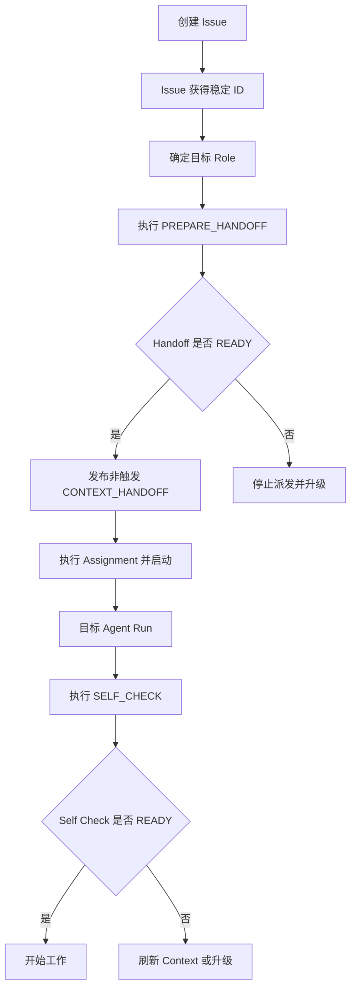
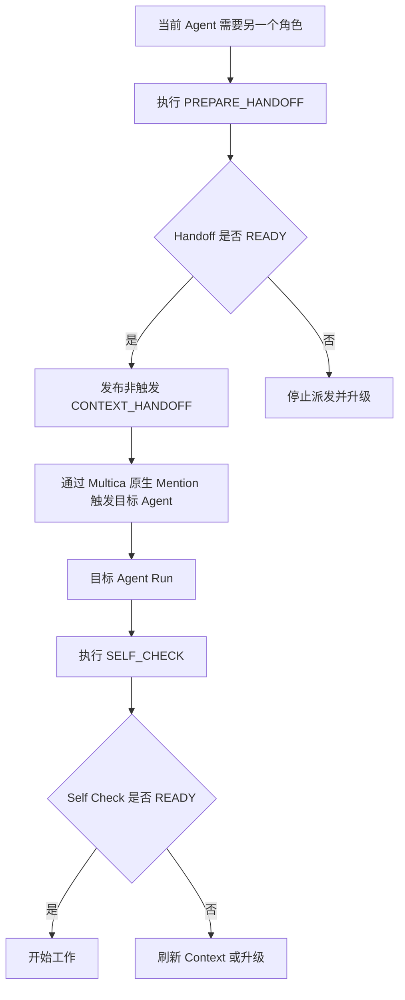
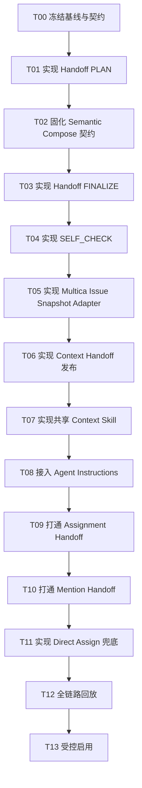
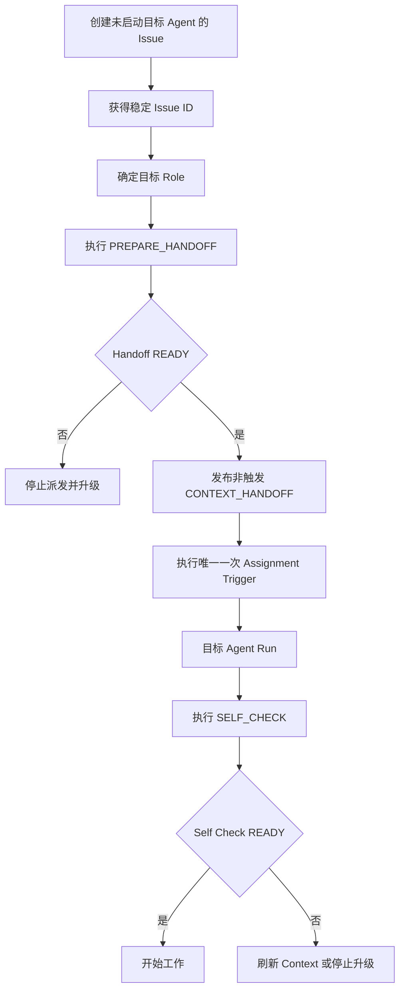
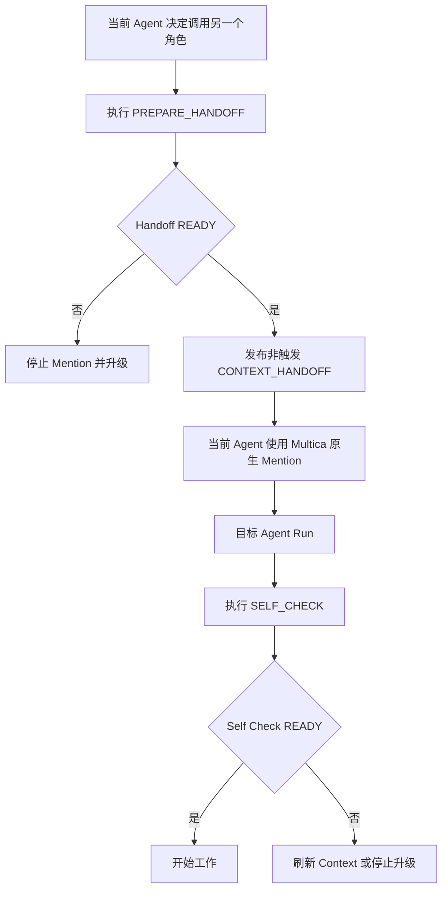

# Context Handoff — Multica 当前可实现方案

> 版本：V1.1  
> 状态：Executable Task Plan  
> 前提：Context & Memory System V1.1 重建已经完成；`prepare_handoff` / `self_check` 按《Context Handoff Native API 设计方案》作为 Memory System 原生能力实施。  
> 目标：在 Multica 当前没有可配置 Issue lifecycle hook 的条件下，可靠实现“目标角色拿到上下文后再开始 Run”。

---

# 0. 当前结论

当前 Multica 方案采用：

```text
Create Issue without Agent Run
↓
prepare_handoff
↓
publish /note CONTEXT_HANDOFF
↓
ONE Multica trigger
↓
Target Agent Run
↓
self_check
↓
Work
```

主路径不依赖：

```text
issue.created hook
run.before_start hook
custom state machine
```

因为当前公开 Multica 能力并没有提供可配置的 Issue lifecycle event trigger。

当前官方/社区事实：

1. Assign Agent/Squad 可以立即启动 Run，也可以 `--no-start` 只记录 ownership。
2. @mention Agent 会创建 Run，但不改变 assignee。
3. `/note` comment 不触发 Agent。
4. Skill 可以包含 `SKILL.md`、scripts、templates、references，并绑定给多个 Agent。
5. 社区已有 issue lifecycle event trigger 请求，说明当前 Autopilot 主要是 schedule/webhook/manual，不提供 `issue.created` 等内部事件 trigger。
6. 社区已有 assignment + @mention 双触发导致重复 Run 的实际案例。

因此当前必须坚持：

> 一次 Handoff 只能选择一个 Run trigger。

---

# 1. 为什么采用“先建 Issue”

不采用：

```text
prepare Engineer Context
↓
create + run Issue
```

作为标准流程。

原因：

```yaml
reasons:
  - issue_id_is_canonical_task_identity
  - issue_definition_is_context_input
  - one_issue_can_have_multiple_roles
  - role_context_has_independent_lifecycle
  - avoid_create_run_before_context_publish_race
```

标准流程：

```text
Issue Boundary
↓
Context Boundary
↓
Execution Boundary
```

---

# 2. Issue 创建策略

## 2.1 Engineering Lead

自动化工作流中，大部分 Child Issue 由 Engineering Lead 创建。

Lead：

```text
Create Child Issue
↓
不要同时触发目标 Agent
↓
确定 target role
↓
prepare_handoff
↓
READY
↓
trigger target
```

## 2.2 团队成员互相建立 Issue

任何 Agent 创建另一个 Agent 的 Issue：

```text
Architect → Engineer
Engineer → Architect
Reviewer → Lead
QA → Engineer
```

必须使用完全相同的 Handoff 协议。

因此协议不依赖 creator role。

硬规则：

> Whoever dispatches the next agent is responsible for preparing the handoff first.

## 2.3 不知道目标 Role

如果创建者无法安全确定目标专业角色：

```text
prepare_handoff(role=engineering_lead)
↓
assign Engineering Squad
```

让 Squad Leader 先运行。

不要生成“万能 Context Package”。

---

# 3. 当前 Multica Run Trigger

当前支持的稳定触发方式：

```text
assignment
@mention
chat
autopilot
```

本方案只使用前两种做团队 Issue 协作。

---

# 4. Assignment Handoff

适用：

> 目标 Agent/Squad 要成为该 Issue 的长期 owner。

推荐主路径：

```text
Issue exists unassigned
↓
prepare_handoff
↓
/note CONTEXT_HANDOFF
↓
assign + start
↓
Run
```

CLI 概念：

```bash
multica issue create \
  --title "..." \
  --description-file issue.md \
  --project <project>
```

不要在 create 时传 Agent/Squad assignee。

然后：

```text
Memory prepare_handoff(...)
```

Adapter 发布：

```text
/note

CONTEXT_HANDOFF
package_id: CTX-...
role: software_engineer
status: READY
...
```

最后：

```bash
multica issue assign YZT-182 --to-id <agent-uuid>
```

这一步才创建目标 Run。

---

# 5. `--no-start` 的定位

Multica 官方支持：

```bash
multica issue assign YZT-182 \
  --to-id <agent-uuid> \
  --no-start
```

它只记录 ownership，不创建 Run。

本方案当前不把它作为默认主路径。

默认：

```text
unassigned
→ context
→ assign+start
```

更少中间状态。

只有需要提前确定 ownership 时使用：

```text
assign --no-start
↓
prepare_handoff
↓
explicit later trigger
```

---

# 6. @mention Handoff

适用：

> 当前 Issue owner 不变，只临时把某个明确请求交给另一个 Agent。

例如 Architect 需要 Engineer 支持。

流程：

```text
Architect Run
↓
prepare_handoff(issue, software_engineer)
↓
publish /note CONTEXT_HANDOFF
↓
Architect 输出真正的 @Engineer mention
↓
Engineer Run
```

重要：

> 纯文本 `@Engineer` 不保证成为 Agent mention；必须使用 Multica 实际 mention 机制。

因此当前不建议由 Adapter 自己伪造 mention 语法。

Adapter 只负责把 Handoff 准备好。

真正的 mention 由当前 Agent 在 Multica 原生回复中完成。

---

# 7. 禁止双触发

以下流程禁止：

```text
assign Engineer
+
同一 Handoff comment @Engineer
```

社区已经出现过这种双 trigger 导致两个 Run、第二个 Run 延迟后重复执行整阶段的问题。

每次 Handoff 必须记录：

```yaml
run_trigger:
  type: assignment | mention
  target_agent_id: ...
```

只能一个。

---

# 8. Multica Adapter

当前目录：

```text
multica-memory/
└── adapters/
    └── multica/
        ├── README.md
        ├── issue_snapshot.py
        ├── handoff_renderer.py
        ├── context_cli.py
        ├── templates/
        │   └── context_handoff.md
        └── tests/
```

Adapter 只负责：

```yaml
adapter_responsibilities:
  - read_multica_issue
  - normalize_task_snapshot
  - invoke_memory_prepare_handoff
  - render_context_handoff_comment
  - publish_note
  - expose_self_check_command
```

Adapter 不负责：

```yaml
forbidden:
  - scope_policy
  - rule_authority
  - fact_verification
  - case_activation
  - memory_promotion
  - memory_grooming
```

---

# 9. Shared Skill

当前 LLM Semantic Runtime 由调用者 Agent 提供，因此必须给协作角色挂载统一 Skill。

建议：

```text
multica-context-handoff/
├── SKILL.md
├── scripts/
├── references/
└── templates/
```

绑定：

```text
01 Engineering Lead
03 Solution Architect
04 Software Engineer
05 Feature Reviewer
06 QA
```

02 Context Engineer 也可以绑定，但它不是正常 Handoff 必经角色。

---

# 10. Skill 的两个动作

## 10.1 PREPARE_HANDOFF

适用：

```text
准备 assign / @mention 下一个 Agent 之前
```

步骤：

```text
1. 获取 issue/task snapshot
2. 确定 target role
3. 调 Memory PLAN
4. 当前 LLM 执行 bounded semantic compose
5. 调 Memory FINALIZE
6. 若 READY：发布 /note CONTEXT_HANDOFF
7. 返回 HANDOFF_READY
8. 调用者随后执行唯一一次 Multica trigger
```

如果 PARTIAL/BLOCKED：

```text
不得正常 trigger downstream agent
```

## 10.2 SELF_CHECK

每个专业 Agent Run 的开工前检查。

步骤：

```text
1. 找当前 Role 对应的最新 CONTEXT_HANDOFF
2. 调 memory self_check
3. READY → work
4. REFRESH_REQUIRED → 为自己刷新 Context
5. BLOCKED → 升级并停止 consequential work
```

---

# 11. Engineering Lead Instructions

新增最小规则：

```text
Before dispatching any downstream agent or squad member:

1. Ensure the target issue exists.
2. Determine the target role.
3. Run PREPARE_HANDOFF.
4. Dispatch only when the handoff is READY or when policy explicitly permits PARTIAL.
5. Use exactly one Multica trigger: assignment OR @mention.
6. Never dispatch dependent work while handoff is BLOCKED.

When you create child issues, create them without starting the target agent first.
```

---

# 12. 03/04/05/06 Instructions

共享最小规则：

```text
RUN START CONTEXT CHECK

Before consequential work:
- run SELF_CHECK for the current issue and your role;
- consume the current valid Context Package;
- if REFRESH_REQUIRED, refresh before continuing;
- if BLOCKED, stop the affected work and escalate.

BEFORE HANDOFF

Before assigning or @mentioning another agent:
- run PREPARE_HANDOFF for the target role;
- dispatch only after the handoff is ready;
- use only one Multica trigger.
```

---

# 13. Context Engineer Instructions

02 收到异常升级时：

```text
resolve scope
verify evidence
resolve/restate conflicts
update Canonical when authorized
rebuild affected context
return status
```

02 不接管：

```text
normal role context generation
issue routing
implementation
architecture decision
feature decision
```

---

# 14. Context Handoff Comment

使用 `/note`，防止发布 Package 本身触发当前 assignee。

模板：

```text
/note

CONTEXT_HANDOFF

Package: CTX-YZT-182-SE-001
Target Role: software_engineer
Status: READY

Task Scope:
...

Project Phase:
...

Anchor:
...

Critical Rules:
...

Current Facts:
...

Checkpoint Slice:
...

Conflicts / Unknowns:
...

Sources:
...

Built From:
task_fingerprint: ...
memory_revision: ...
role_profile_revision: ...
```

---

# 15. `self_check` 如何找 Package

第一版不需要复杂服务端状态。

可以：

```text
读取 Issue comments
↓
查找最新 CONTEXT_HANDOFF
↓
匹配:
task_ref
target_role
package_id
```

然后将 Package metadata 交给 Memory `self_check`。

如果未来 Multica 提供更稳定的 context_refs/custom field，再迁移 storage pointer。

---

# 16. Assignment 主流程

## Machine View

```yaml
assignment_handoff:
  creator: engineering_lead_or_any_agent

  steps:
    - create_issue_without_agent_start
    - resolve_target_role
    - prepare_handoff
    - require_ready
    - publish_note
    - assign_and_start
    - target_self_check
    - execute

  trigger_count: 1
```

## Human View



---

# 17. Mention 主流程

## Machine View

```yaml
mention_handoff:
  steps:
    - existing_issue
    - resolve_target_role
    - prepare_handoff
    - publish_note
    - current_agent_mentions_target
    - target_run
    - self_check
```

## Human View



---

# 18. Lead 创建 Child Issue 示例

```text
Lead Run
↓
根据 Parent Context 决定需要 Engineer
↓
multica issue create child
↓
得到 YZT-182
↓
PREPARE_HANDOFF(issue=YZT-182, role=software_engineer)
↓
HANDOFF_READY
↓
multica issue assign YZT-182 --to-id <engineer>
↓
Engineer Run
↓
SELF_CHECK
↓
Implementation
```

---

# 19. Architect 创建 Engineer Issue 示例

完全一样：

```text
Architect
↓
create child issue
↓
prepare_handoff(role=software_engineer)
↓
READY
↓
assign Engineer
```

因此该机制天然覆盖“团队成员互相建立 Issue”。

---

# 20. 直接人工 Assign 的兜底

当前 Multica 没有可配置的 before-run hook。

所以用户在 UI 里直接把 Issue assign 给 Engineer 时，无法保证 platform-level 在 Run 创建前执行 Memory Script。

这就是 `SELF_CHECK` 必须存在的原因。

```text
Human direct assign
↓
Engineer Run starts
↓
SELF_CHECK
↓
package missing
↓
refresh self context
↓
READY → work
BLOCKED → stop/escalate
```

这是行为层 fail-safe，不是平台层 before-run guarantee。

---

# 21. 当前不使用 Autopilot 实现门禁

社区和当前公开能力表明 Autopilot 没有通用：

```text
issue.created
issue.assigned
issue.status_changed
run.before_start
```

事件 trigger。

因此不把 P0 实现建立在 Autopilot 上。

未来 Multica 若加入原生 issue lifecycle / run hook，可以把：

```text
PREPARE_HANDOFF
SELF_CHECK
```

映射到 Hook，而不用改变 Memory API。

---

# 22. Run 触发纪律

必须固定：

```yaml
dispatch_rule:
  one_handoff_one_trigger: true

  allowed:
    - assignment
    - mention

  forbidden:
    - assignment_plus_mention
    - publish_context_with_triggering_comment_before_intended_dispatch
```

`/note` 用于 Context Package。

它本身不能产生 Run。

---

# 23. 当前实施总策略

本阶段不是重新建设 Memory System。

前提已经成立：

```yaml
preconditions:
  memory_system:
    version: v1.1
    rebuild_completed: true
    canonical_migration_completed: true
    scope_first_retrieval_available: true
    role_profiles_available: true
    context_package_builder_available: true
    gate_a_b_c_passed: true
```

本轮只增加：

```text
Context Native API
+
当前 caller-LLM Semantic Runtime
+
Multica Adapter
+
Skill / Instructions
+
真实 Handoff 门禁
```

实施采用**严格串行 Task 链**。

除非当前 Task 的 Done Criteria 全部通过，否则不得进入下一 Task。

---

# 24. Task 执行总览

## Machine View

```yaml
execution_plan:
  sequence:
    - T00_baseline_and_contract_freeze
    - T01_prepare_handoff_plan
    - T02_semantic_compose_contract
    - T03_prepare_handoff_finalize
    - T04_self_check
    - T05_multica_issue_snapshot_adapter
    - T06_context_handoff_publish
    - T07_shared_context_skill
    - T08_agent_instruction_integration
    - T09_assignment_handoff_path
    - T10_mention_handoff_path
    - T11_direct_assignment_fallback
    - T12_end_to_end_replay
    - T13_controlled_enablement

  rule:
    next_task_requires_previous_done: true
```

## Human View



---

# 25. T00 — 冻结实现基线与 Native API 契约

## 25.1 目标

在写代码前冻结本轮新增能力的接口和边界，防止 Skill、Adapter、Core 各自发明一套字段。

## 25.2 输入

```text
Context & Memory System V1.1 已完成实现
Context Handoff Native API 设计方案
本 Multica 实施方案
当前 role profiles
当前 Task Context Package schema
当前 context_cli / builder
```

## 25.3 动作

1. 读取当前实际 Memory V1.1 实现，不根据设计文档猜目录或命令。
2. 确认现有 Context Package Builder 哪些能力可以直接复用。
3. 新增或冻结以下 schema：
   - `prepare_handoff_request`
   - `context_plan`
   - `semantic_compose_result`
   - `prepare_handoff_result`
   - `self_check_request`
   - `self_check_result`
   - `context_handoff_metadata`
4. 冻结状态枚举：

```yaml
prepare_handoff_status:
  - READY
  - PARTIAL
  - BLOCKED

self_check_status:
  - READY
  - REFRESH_REQUIRED
  - BLOCKED
```

5. 冻结框架无关引用：

```yaml
refs:
  task_ref: string
  workflow_ref: optional_string
```

6. 明确 Core schema 中不得出现：
   - squad
   - mention
   - assignee
   - Multica Run
   - Multica Stage
   - Multica comment routing

## 25.4 产物

```text
schemas/context-handoff/
native API contract
schema tests
implementation mapping note
```

## 25.5 Done Criteria

```yaml
done:
  all_new_schemas_validate: true
  no_multica_concept_in_native_schema: true
  existing_v1_1_package_compatibility_defined: true
  no_duplicate_context_package_schema: true
```

## 25.6 Stop Conditions

如果发现当前 V1.1 实现与设计文档存在影响 Native API 的系统性偏差：

```text
STOP
→ 记录 Gap
→ 不在本 Task 偷改 Memory Core 语义
```

---

# 26. T01 — 实现 `prepare_handoff` Deterministic PLAN

## 26.1 目标

实现不依赖 LLM 的 Handoff Planning。

PLAN 必须先把 LLM 能看到的候选集合收窄。

## 26.2 输入

```yaml
input:
  task_ref: ...
  project_id: ...
  target_role: ...
  purpose: ...
  task_snapshot: ...
```

## 26.3 动作

复用现有 V1.1 能力，依次执行：

```text
Resolve Task Scope
→ Resolve Project
→ Read Project Phase
→ Resolve Target Role Profile
→ Load Anchor baseline
→ Select Project Checkpoint candidate slice
→ Select Team Checkpoint candidate slice when needed
→ Strict Scope Filter
→ Lifecycle Filter
→ Verification Filter
→ Rule Candidate Retrieval
→ Fact Candidate Retrieval
→ Case Hard Eligibility
→ Evidence / Conflict Candidate Selection
→ Produce bounded semantic jobs
```

PLAN 阶段不得：

```text
调用 LLM
扩大 Scope
生成最终摘要
修改 Canonical
创建 Multica Comment
```

## 26.4 产物

```yaml
context_plan:
  plan_id: ...
  task_ref: ...
  role: ...
  scope: ...
  hard_filters_applied: []
  candidates:
    anchor: []
    checkpoint_entries: []
    rules: []
    facts: []
    cases: []
    evidence: []
    conflicts: []
  semantic_jobs: []
```

## 26.5 测试

必须包含：

```text
Project Scope Isolation
Cross-project explicit-list requirement
Role Profile selection
Archived project exclusion
review_needed behavior
Case hard gate
Rule Authority presence
```

## 26.6 Done Criteria

```yaml
done:
  scope_pollution: 0
  llm_called: false
  plan_is_deterministic: true
  candidates_are_bounded: true
```

---

# 27. T02 — 固化 Bounded Semantic Compose 契约

## 27.1 目标

把“需要 LLM 判断的部分”正式限制在一个可审计的输入/输出协议里。

本 Task 只定义和验证 semantic contract，不接 Multica。

## 27.2 LLM 可以做

```yaml
allowed_semantic_jobs:
  - interpret_task_intent
  - select_task_applicable_rules_from_candidates
  - select_decision_relevant_facts_from_candidates
  - compress_checkpoint_slice
  - perform_case_scenario_match_when_case_search_already_allowed
  - phrase_visible_conflicts
  - produce_minimum_sufficient_context
```

## 27.3 LLM 不可以做

```yaml
forbidden:
  - expand_scope
  - invent_authority
  - promote_verification
  - change_project_phase
  - bypass_case_hard_gate
  - add_memory_not_in_plan
  - write_canonical
```

## 27.4 输出

```yaml
semantic_compose_result:
  plan_id: ...
  selected_rule_ids: []
  selected_fact_ids: []
  selected_case_ids: []
  checkpoint_entry_ids: []
  conflict_ids: []
  anchor_digest: ...
  context_summary: ...
  semantic_notes: []
```

禁止 LLM 直接返回一篇自由 Markdown 作为唯一结果。

## 27.5 测试

至少准备：

```text
normal CRUD task
cross-repo task
architecture task
conflicted evidence task
case no-match task
case match task
```

检查 LLM 是否能越过 PLAN 提供的 ID 集合。

## 27.6 Done Criteria

```yaml
done:
  output_schema_enforced: true
  selected_ids_subset_of_plan: true
  scope_cannot_expand: true
  case_gate_cannot_be_overridden: true
```

---

# 28. T03 — 实现 `prepare_handoff` FINALIZE

## 28.1 目标

将 PLAN + Semantic Result 变成经过确定性验证的正式 Role Context Package。

## 28.2 动作

FINALIZE 必须检查：

```text
plan_id match
task_ref match
role match
scope match
selected IDs belong to PLAN
Rule authority valid
Verification legal
Case eligibility legal
Conflict not hidden
Context budget
Package schema
```

生成：

```yaml
prepare_handoff_result:
  status: READY | PARTIAL | BLOCKED
  package_id: ...
  built_from:
    task_fingerprint: ...
    memory_revision: ...
    registry_revision: ...
    role_profile_revision: ...
  package: ...
  escalation: ...
```

## 28.3 READY / PARTIAL / BLOCKED 判定

判定优先使用确定性 Policy。

LLM 不直接决定最终 Gate 状态。

## 28.4 Done Criteria

```yaml
done:
  invalid_rule_authority: 0
  hidden_conflict: 0
  package_schema_valid: true
  task_and_role_bound: true
  built_from_present: true
```

---

# 29. T04 — 实现 `self_check`

## 29.1 目标

让已启动 Agent 低成本判断现有 Package 是否仍可使用。

默认不重新运行完整 Handoff Build。

## 29.2 检查顺序

```text
Find Package
→ task_ref match
→ role match
→ scope match
→ package status
→ task fingerprint
→ registry revision
→ role profile revision
→ relevant memory revision validity
```

输出：

```yaml
self_check_result:
  status: READY | REFRESH_REQUIRED | BLOCKED
  package_id: ...
  reasons: []
  action: USE_EXISTING | REFRESH | ESCALATE
```

## 29.3 Fingerprint 规则

不要把全部 Issue comments 纳入 fingerprint。

只纳入：

```text
title
description
requirements
acceptance criteria
explicit scope
relevant human decisions
```

普通进度评论不得让 Package 自动失效。

## 29.4 Done Criteria

```yaml
done:
  normal_check_requires_llm: false
  missing_package_detected: true
  role_mismatch_detected: true
  changed_task_detected: true
  stale_package_detected: true
```

---

# 30. T05 — 实现 Multica Issue Snapshot Adapter

## 30.1 目标

把 Multica Issue 转成 Native API 认识的 framework-neutral `task_snapshot`。

## 30.2 动作

从当前部署的 Multica 能力读取：

```text
issue id
project
title
description
requirements / acceptance information if available
parent relation
selected task-defining decisions
current assignee metadata when needed by Adapter
```

标准化为：

```yaml
task_snapshot:
  task_ref: multica://issue/...
  project_id: ...
  title: ...
  description: ...
  requirements: []
  acceptance_criteria: []
  parent_task_ref: ...
  relevant_decisions: []
```

## 30.3 强约束

Adapter 不解释 Memory Scope。

Adapter 只做：

```text
Multica object
→ neutral snapshot
```

## 30.4 CLI Compatibility Check

实施时先执行当前部署版本 CLI help / capability check。

如果命令名、参数与文档示例不同，以实际部署版本为准，并记录 adapter compatibility note。

## 30.5 Done Criteria

```yaml
done:
  issue_snapshot_reproducible: true
  no_memory_policy_in_adapter: true
  task_ref_stable: true
```

---

# 31. T06 — 实现 Context Handoff 发布

## 31.1 目标

将 READY/PARTIAL Package 以**非触发方式**持久写入 Multica Issue。

## 31.2 Handoff Metadata

```yaml
context_handoff:
  package_id: ...
  task_ref: ...
  target_role: ...
  status: ...
  built_from: ...
  prepared_by: ...
  prepared_at: ...
```

## 31.3 Comment

使用当前部署版本确认可用的非触发 comment 方式。

预期格式：

```text
/note

CONTEXT_HANDOFF
...
```

如果部署版本不支持 `/note`：

```text
STOP
```

不能用可能触发当前 assignee 的普通 comment 代替后继续测试。

## 31.4 查找规则

为 `self_check` 提供：

```text
find latest valid CONTEXT_HANDOFF
by task_ref + target_role
```

## 31.5 Done Criteria

```yaml
done:
  publish_does_not_create_run: true
  package_round_trip_readable: true
  latest_role_package_resolvable: true
```

---

# 32. T07 — 实现共享 `context-handoff` Skill

## 32.1 目标

利用当前 Agent LLM 完成 Native API 中的 bounded semantic work。

## 32.2 Skill 动作

Skill 只暴露两个用户/Agent 语义动作：

```text
PREPARE_HANDOFF
SELF_CHECK
```

### PREPARE_HANDOFF

内部：

```text
read task snapshot
→ call PLAN
→ execute only listed semantic_jobs
→ submit structured semantic result
→ call FINALIZE
→ if publishable, call Adapter publisher
```

### SELF_CHECK

内部：

```text
find current role package
→ call self_check
→ READY: return
→ REFRESH_REQUIRED: execute self refresh
→ BLOCKED: escalate / stop
```

## 32.3 Skill 不得复制

```text
Scope policy
Authority policy
Case policy
Lifecycle policy
Retention policy
```

这些仍来自 Core。

## 32.4 Done Criteria

```yaml
done:
  skill_can_complete_ready_handoff: true
  skill_cannot_expand_plan_candidates: true
  blocked_result_stops_workflow: true
  ordinary_ready_path_does_not_call_context_engineer: true
```

---

# 33. T08 — 接入 Agent Instructions

## 33.1 目标

把 Skill 变成所有协作角色的稳定行为协议。

## 33.2 Engineering Lead

加入：

```text
Before dispatching downstream work:
- target issue must exist;
- determine target role;
- run PREPARE_HANDOFF;
- do not trigger downstream work while BLOCKED;
- use exactly one trigger.
```

Lead 创建 Child Issue 时：

```text
create without target Agent Run
→ prepare handoff
→ trigger
```

## 33.3 03 / 04 / 05 / 06

加入：

```text
At run start:
- run SELF_CHECK before consequential work.

Before dispatching another agent:
- run PREPARE_HANDOFF first.
```

## 33.4 Context Engineer

只增加异常处理协议。

不得把普通 Handoff 都路由给 02。

## 33.5 Done Criteria

对每个角色做静态审计：

```yaml
done:
  lead_has_pre_dispatch_gate: true
  professional_agents_have_self_gate: true
  professional_agents_have_pre_handoff_gate: true
  context_engineer_not_normal_path: true
```

---

# 34. T09 — 打通 Assignment Handoff 主路径

## 34.1 目标

实现自动化工作流最常用路径：

```text
Lead / Agent 创建新 Issue
→ Context READY
→ Assignment
→ Run
```

## 34.2 严格顺序

```text
1. Create Issue without target Agent Run
2. Obtain canonical issue id
3. Resolve target role
4. PREPARE_HANDOFF
5. Publish non-trigger Context Handoff
6. Confirm HANDOFF_READY
7. Assignment trigger
8. Target Run starts
9. Target SELF_CHECK
10. Work
```

## 34.3 Human View



## 34.4 必测

```text
Lead creates Engineer child issue
Architect creates Engineer issue
unknown role routes to Engineering Lead/Squad
PARTIAL policy path
BLOCKED path
```

## 34.5 Done Criteria

```yaml
done:
  run_before_handoff: 0
  intended_run_count_per_handoff: 1
  self_check_ready_before_work: true
```

---

# 35. T10 — 打通 Mention Handoff 路径

## 35.1 目标

支持现有 Issue 内 Agent 临时调用另一个角色，同时保持 assignee 不变。

## 35.2 严格顺序

```text
Current Agent
→ determine target role
→ PREPARE_HANDOFF
→ publish non-trigger Handoff
→ current Agent emits real Multica mention
→ target Run
→ SELF_CHECK
→ Work
```

## 35.3 Human View



## 35.4 强约束

Adapter 不自行拼装 mention markdown。

必须使用 Multica 提供给 Agent 的真实 mention 能力。

## 35.5 Done Criteria

```yaml
done:
  assignee_unchanged: true
  mention_creates_one_run: true
  assignment_not_also_used: true
  target_self_check_passes: true
```

---

# 36. T11 — Direct Assignment Self-Check 兜底

## 36.1 目标

覆盖无法被当前平台 pre-run hook 拦截的路径：

```text
Human UI direct assign
遗漏 PREPARE_HANDOFF
其他非标准入口
```

## 36.2 流程

```text
Run starts
→ SELF_CHECK
→ no valid package
→ REFRESH_REQUIRED
→ Agent 为自己执行 Context Refresh
→ READY: work
→ BLOCKED: stop / escalate
```

## 36.3 重要边界

这不是 platform-level hard pre-run gate。

这是：

> Run 已开始，但 consequential work 尚未开始。

因此 Agent Instructions 必须把 SELF_CHECK 放在专业工作之前。

## 36.4 Done Criteria

```yaml
done:
  missing_handoff_detected: true
  agent_does_not_guess: true
  blocked_agent_stops_consequential_work: true
```

---

# 37. T12 — 全链路 Replay 与负向验证

## 37.1 目标

不是证明“CLI 能运行”，而是证明实际协作链不会绕过 Context Gate。

## 37.2 场景

```yaml
scenarios:
  - lead_creates_engineer_child_issue
  - architect_creates_engineer_issue
  - existing_issue_mention_handoff
  - human_direct_assignment_without_handoff
  - blocked_context
  - partial_context
  - cross_project_task
  - changed_issue_invalidates_package
  - stale_role_profile_invalidates_package
  - assignment_plus_mention_is_rejected
```

## 37.3 必须记录

每个 Replay：

```yaml
replay_result:
  task_ref: ...
  creator_role: ...
  target_role: ...
  handoff_status: ...
  package_id: ...
  trigger_type: ...
  run_count: ...
  self_check_status: ...
  scope_pollution: ...
  hidden_conflict: ...
  invalid_authority: ...
  result: PASS | FAIL
```

## 37.4 Hard Gate

```yaml
hard_requirements:
  normal_path_run_before_ready_handoff: 0
  more_than_one_intended_run_per_handoff: 0
  scope_pollution: 0
  invalid_rule_authority: 0
  hidden_unresolved_conflict: 0
  self_check_misses_stale_or_missing_package: 0
  context_engineer_called_for_ordinary_ready_build: 0
```

任一失败：

```text
NOT_READY_FOR_ENABLEMENT
```

---

# 38. T13 — 受控启用

## 38.1 目标

在不一次性强制全团队的情况下启用新 Handoff 协议。

## 38.2 启用顺序

```text
1. Engineering Lead automated child-issue path
2. Lead → Architect / Engineer assignment
3. Architect / Engineer mutual handoff
4. Feature Reviewer / QA handoff
5. direct-assignment fallback
```

不要第一天同时修改所有自动化路径。

## 38.3 观察指标

```text
missing_handoff
refresh_required_rate
blocked_handoff
false_activation
context_size
context_density
reinvestigation
duplicate_run
context_engineer_escalation
```

## 38.4 Done Criteria

```text
CONTEXT_HANDOFF_ENABLED
```

表示：

```text
正常自动派发路径已默认 prepare_handoff
所有专业角色已默认 self_check
Context Engineer 只处理异常
旧直接派发仍有 self-check 兜底
```

---

# 39. Task 间依赖矩阵

| Task | 必须依赖 | 核心产物 | 未通过时禁止 |
|---|---|---|---|
| T00 | Memory V1.1 完成 | API/Schema Contract | 全部后续 |
| T01 | T00 | Deterministic Context Plan | T02+ |
| T02 | T01 | Semantic Compose Contract | T03+ |
| T03 | T02 | Finalized Handoff Package | T04+ |
| T04 | T03 | Self Check | Adapter/Skill 接入 |
| T05 | T04 | Multica Task Snapshot | T06+ |
| T06 | T05 | Non-trigger Handoff Publish | T07+ |
| T07 | T06 | Shared Skill | Agent 接入 |
| T08 | T07 | Agent behavior contract | 真正 Run 路径 |
| T09 | T08 | Assignment path | 自动化启用 |
| T10 | T09 | Mention path | 团队互派启用 |
| T11 | T10 | Direct-assign fallback | 全链路验收 |
| T12 | T11 | Replay Report | 启用 |
| T13 | T12 PASS | Controlled Enablement | 全面使用 |

---

# 40. 建议的 Issue 拆分

实际在 Multica 中建议一个 Task 对应一个实施 Issue：

```text
CTX-HO-00 Freeze Native API Contract
CTX-HO-01 Implement Deterministic Handoff Plan
CTX-HO-02 Define Bounded Semantic Compose
CTX-HO-03 Implement Handoff Finalize
CTX-HO-04 Implement Self Check
CTX-HO-05 Implement Multica Issue Snapshot Adapter
CTX-HO-06 Implement Non-trigger Handoff Publisher
CTX-HO-07 Build Shared Context Handoff Skill
CTX-HO-08 Integrate Agent Instructions
CTX-HO-09 Enable Assignment Handoff
CTX-HO-10 Enable Mention Handoff
CTX-HO-11 Add Direct Assignment Fallback
CTX-HO-12 Run End-to-End Replay
CTX-HO-13 Controlled Enablement
```

父 Issue 只负责：

```text
顺序
依赖
验收
最终状态
```

不要把全部实现重新塞进一个大型 Issue。

---

# 41. 当前明确不做

```text
HTTP service
MCP server
independent semantic model
issue lifecycle polling
custom Multica plugin
Autopilot workaround polling
before-run polling daemon
```

这些都不属于当前 Task 链。

---

# 42. 最终实施门禁

只有 T12 全部 Hard Gate 通过，才允许 T13。

最终目标不是：

> “Context Package 能生成”。

而是：

> “正常自动化派发路径中，下游 Agent 不会在有效 Role Context Handoff 之前开始 consequential work；非标准入口也会被 SELF_CHECK 捕获。”

---


# 43. 当前官方事实依据

截至 2026-09：

- Multica Assign 可以 Start，也可以 “Don't start yet” / CLI `--no-start`。
- Agent/Squad assignment 启动 Run；Squad assignment 会先启动 Leader。
- Agent @mention 创建 Run但不改变 assignee。
- `/note` comment 不触发 Agent。
- Skill 支持 SKILL.md + scripts/templates/references，并可绑定多个 Agent。
- 当前社区仍在请求 issue lifecycle event-triggered Autopilot，说明内部 Issue event hook 不是现成可配置能力。
- 社区已有 assignment 与 mention 双触发造成重复 execution chain 的案例。

实现时应再次核对所部署 Multica 版本的 CLI help，避免版本差异。

官方与社区参考：

- https://multica.ai/docs/assigning-issues
- https://multica.ai/docs/mentioning-agents
- https://multica.ai/docs/comments
- https://multica.ai/docs/skills
- https://multica.ai/docs/cli
- https://github.com/multica-ai/multica/issues/4861
- https://github.com/multica-ai/multica/issues/7237

---

# 44. 未来演进（仅核心）

未来若 Multica 提供：

```text
issue.created
issue.assigned
run.before_start
```

等原生 Hook：

```text
Hook
↓
prepare_handoff / self_check
```

即可把当前 Skill 行为门禁升级成 platform-level gate。

Memory API 和 Context Package 不需要变化。

---

# 45. 最终原则

> 在当前 Multica 中，不等待不存在的 Hook。

> 自动工作流通过“先建 Issue、prepare_handoff、再触发 Run”实现正常路径硬约束。

> Self Check 负责兜底 Human/UI/遗漏路径。

> Context Package 使用 `/note` 作为非触发型持久 Handoff。

> Assignment 和 @mention 二选一；同一次 Handoff 绝不双触发。

> Skill 借用当前 Agent LLM 实现 bounded semantic compose；Memory Core 仍保持框架无关。
