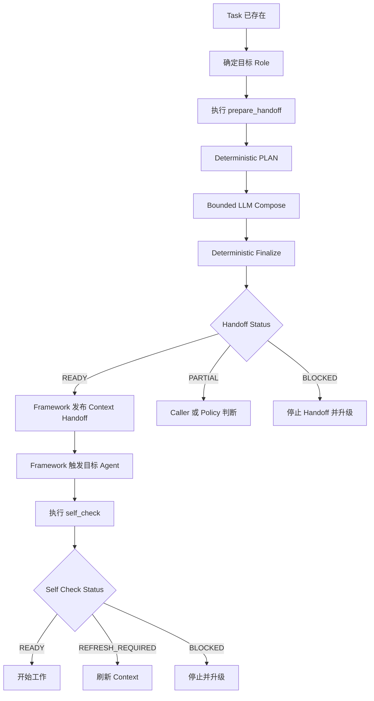

# Context Handoff Native API 设计方案

> 版本：V1.1  
> 状态：Current Implementation Baseline  
> 前提：Context & Memory System V1.1 重建已经完成并通过迁移门禁；本方案不再设计旧 V1 兼容语义。  
> 目标：把“下游角色开工前获得最小充分上下文”定义为 Memory System 的原生能力，而不是某个调度框架的特例。  
> 适用范围：当前优先支持 Multica；设计本身必须保持 framework-neutral。

---

# 0. 结论

Memory System 原生提供四个能力：

```text
prepare_handoff()
self_check()
report_finding()
challenge_context()
```

其中本阶段重点实现：

```text
prepare_handoff()
self_check()
```

它们不是 Multica API，也不是 Skill 本身。

正确分层：

```text
调度框架
Multica / Future Harness
        │
Skill / Hook / MCP / CLI / API Adapter
        │
        ▼
Context Native API
prepare_handoff / self_check
        │
        ▼
Context Semantic Runtime
Deterministic Plan
→ Bounded LLM
→ Deterministic Finalize
        │
        ▼
Context & Memory Core
Anchor / Rule / Fact / Case
Checkpoint / Evidence / Authority
```

核心原则：

> Memory System 决定“目标角色在当前任务上应该知道什么”；  
> 调度框架只决定“什么时候、通过什么机制让目标角色拿到它并开始 Run”。

当前不建设独立 LLM 服务。

当前 Semantic Runtime：

```yaml
semantic_runtime:
  mode: caller_llm_via_skill
```

未来可以替换为独立 Context Runtime，但原生能力协议不改变。

---

# 1. 设计目标

本方案解决四个问题：

1. 角色上下文不能依赖 Engineering Lead 人工拼装。
2. Context Package 生成包含语义判断，不能假设纯 Python/RAG 可以完整完成。
3. Memory Core 不能感知 Squad、@mention、Run、Stage 等调度框架内部概念。
4. 不同框架必须能通过不同接入方式复用同一套 Context 能力。

非目标：

- 不建设通用工作流引擎；
- 不建设独立 Context LLM Service；
- 不让 Context Engineer 成为每次 Context Build 的人工 API；
- 不要求所有 Context Build 使用向量检索；
- 不把 Task Context Package 变成 Canonical Memory。

---

# 2. 稳定边界

## 2.1 Context & Memory Core

Core 负责：

```yaml
core_responsibilities:
  - scope_resolution
  - project_registry
  - project_anchor
  - team_checkpoint
  - project_checkpoint
  - rule_retrieval
  - fact_retrieval
  - case_activation_policy
  - evidence
  - authority
  - lifecycle
  - verification
  - source_change_revalidation
  - canonical_validation
```

Core 不认识：

```yaml
forbidden_framework_concepts:
  - multica_squad
  - multica_run
  - multica_assignee
  - multica_mention
  - multica_stage
  - multica_comment_routing
```

允许存在的外部引用只有抽象引用：

```yaml
task_ref: multica://issue/YZT-182
workflow_ref: optional
source_ref: optional
```

## 2.2 Context Native API

Native API 是 Memory System 对外稳定能力层。

第一阶段：

```yaml
native_api:
  prepare_handoff:
    purpose: >
      为一个已明确 Task Identity 和目标 Role 的下一次执行，
      构造并验证最小充分 Role Context Package。

  self_check:
    purpose: >
      判断当前 Role 是否拥有可直接使用、仍然有效的 Context Package；
      默认不执行完整重建。

  report_finding:
    status: existing_system_capability

  challenge_context:
    status: existing_system_capability
```

Native API 只描述语义，不规定调用技术。

可能的 transport：

```text
CLI
Skill
MCP
HTTP
Hook
SDK
```

---

# 3. 为什么 `prepare_handoff` 是原生能力

`prepare_handoff` 不是“把几段 Memory 拼起来”。

它至少需要：

```text
Resolve Task Scope
↓
Resolve Project Phase
↓
Resolve Target Role
↓
Load Role Context Profile
↓
Load Anchor / Checkpoint
↓
Strict Scope Filter
↓
Retrieve Rules
↓
Retrieve Facts
↓
Decide whether Case Search is needed
↓
Select task-relevant evidence/conflicts
↓
Semantic Compression / Composition
↓
Validate
↓
Task Context Package
```

其中一部分必须确定性执行，一部分允许 LLM 参与。

所以它应该是 Memory System 自己的一级能力，而不是某个 Multica Skill 中的临时 prompt。

---

# 4. `prepare_handoff` 契约

## 4.1 输入

```yaml
prepare_handoff_request:
  task_ref: multica://issue/YZT-182

  project:
    project_id: app1

  target:
    role: software_engineer

  purpose: implementation

  task_snapshot:
    title: ...
    description: ...
    requirements: []
    acceptance_criteria: []
    relevant_decisions: []
    parent_task_ref: optional

  caller:
    role: engineering_lead

  options:
    max_context_tier: 1
```

`task_snapshot` 由 Adapter 从调度框架读取并标准化。

Core 不负责主动读取 Multica。

## 4.2 输出

```yaml
prepare_handoff_result:
  status: READY | PARTIAL | BLOCKED

  package_id: CTX-YZT-182-SE-001

  task_ref: multica://issue/YZT-182
  role: software_engineer

  built_from:
    task_fingerprint: sha256:...
    memory_revision: ...
    registry_revision: ...
    role_profile_revision: ...

  package:
    scope: ...
    project_phase: ...
    anchor_digest: ...
    team_state_slice: ...
    project_state_slice: ...
    rules: []
    current_facts: []
    cases: []
    open_conflicts: []
    task_evidence: []
    source_refs: []
    assembly_trace: ...

  escalation:
    required: false
    reason: null
```

---

# 5. 状态语义

## READY

表示：

> 当前 Package 足以支持目标 Role 开始当前阶段工作。

不是永久认证。

## PARTIAL

表示：

> Package 已有价值，但仍有显式缺口；该缺口不一定阻止当前阶段。

Adapter / Caller 决定是否可以派发，但必须把缺口保留在 Handoff。

对于高风险事项，Policy 可以把某些 PARTIAL 自动提升为 BLOCKED。

## BLOCKED

表示：

> 当前缺失/冲突会导致目标 Role 无法安全开始当前决策或实现。

典型原因：

```text
scope_ambiguous
authority_gap
evidence_conflict
review_needed_critical_memory
hard_recoverable_unknown
cross_project_boundary_unknown
```

BLOCKED 不允许 Adapter 正常触发下游 Role。

---

# 6. Semantic Runtime

## 6.1 设计原则

统一模式：

```text
Deterministic Plan
↓
Bounded LLM Semantic Work
↓
Deterministic Finalize / Validate
```

LLM 不能自由扫描全部 Memory，也不能自行改变 Canonical。

## 6.2 Phase A — PLAN

纯确定性。

示例：

```yaml
context_plan:
  task_ref: ...
  scope:
    type: project
    project_id: app1

  role: software_engineer

  required_sections:
    - anchor_digest
    - project_checkpoint
    - applicable_rules
    - relevant_facts

  case_search:
    allowed: false

  candidates:
    rules: [...]
    facts: [...]
    checkpoint_entries: [...]
    evidence: [...]

  semantic_jobs:
    - choose_task_applicable_rules
    - choose_decision_relevant_facts
    - compress_checkpoint_slice
```

PLAN 阶段完成所有硬过滤：

```text
Scope
Lifecycle
Verification
Role Eligibility
Project Phase
Authority presence
Case hard gate
```

## 6.3 Phase B — SEMANTIC COMPOSE

当前执行者：

```yaml
executor: caller_agent_llm_via_skill
```

LLM 只接收 PLAN 给出的 bounded candidates。

允许的语义工作：

```text
task intent interpretation
applicability residual matching
decision relevance
minimum sufficient compression
scenario match for already-eligible Cases
conflict wording
```

不允许：

```text
扩大 Scope
创造 Rule Authority
把 unverified 自动提升 verified
绕过 Case hard gate
修改 Project Phase
修改 Canonical Memory
```

## 6.4 Phase C — FINALIZE

纯确定性。

检查：

```yaml
finalize_checks:
  - task_ref_match
  - role_match
  - scope_match
  - package_schema_valid
  - every_rule_authority_valid
  - no_cross_scope_object
  - no_forbidden_case
  - conflict_not_hidden
  - package_size_within_budget
```

然后产生 package_id 和 built_from fingerprint。

---

# 7. 为什么当前使用 Skill

当前并不建设 Context 自有 LLM Service。

所以需要借用已经运行的 Agent LLM 完成 Phase B。

Skill 正好承担：

```text
调用 PLAN CLI
↓
读取 bounded semantic jobs
↓
调用当前 Agent 的推理能力完成 Semantic Compose
↓
提交 FINALIZE CLI
```

Skill 是“LLM Execution Adapter”。

Skill 不是 Context 规则的权威来源。

---

# 8. Skill 结构

推荐：

```text
context-handoff/
├── SKILL.md
├── references/
│   ├── semantic-contract.md
│   └── output-schema.md
├── scripts/
│   ├── prepare_plan.py
│   ├── finalize_handoff.py
│   └── self_check.py
└── templates/
    └── semantic-result.yaml
```

SKILL.md 只描述：

```text
when to call
how to call PLAN
how to execute bounded semantic jobs
how to submit FINALIZE
when to stop
```

Memory policy 不复制到 Skill。

---

# 9. `self_check` 设计

## 9.1 目标

`self_check` 回答：

> 当前已经被触发的这个 Role，能否直接使用已有 Package 开工？

它不是每 Run 都重新完整 Build。

## 9.2 输入

```yaml
self_check_request:
  task_ref: multica://issue/YZT-182
  role: software_engineer

  task_snapshot:
    ...

  package_ref: optional
```

## 9.3 确定性检查

```text
Package exists?
↓
Task match?
↓
Role match?
↓
Scope match?
↓
Package status READY?
↓
task_fingerprint still valid?
↓
memory/registry/role revisions still acceptable?
```

全部通过：

```yaml
status: READY
action: USE_EXISTING
```

## 9.4 需要 Refresh

```yaml
status: REFRESH_REQUIRED
reason:
  - task_changed
  - package_missing
  - package_stale
  - role_mismatch
```

这时可以调用 `prepare_handoff` 为自己重建。

## 9.5 BLOCKED

如果重建过程中得到 BLOCKED：

```yaml
status: BLOCKED
action: ESCALATE
```

框架 Adapter 决定如何停止/升级。

---

# 10. Context Package 不是 Issue Context

必须保持：

```text
Task Identity
≠
Role Context Package
```

一个 Task 可以存在：

```text
CTX-Lead-v2
CTX-Architect-v1
CTX-Engineer-v3
CTX-QA-v1
```

因此 Package 必须是：

```yaml
runtime_artifact: true
canonical_memory: false
task_scoped: true
role_scoped: true
versioned: true
```

---

# 11. Task Fingerprint

当前必须为 Package 建立有效性判定。

推荐 fingerprint 输入：

```yaml
task_fingerprint_inputs:
  - task_ref
  - title
  - description
  - requirements
  - acceptance_criteria
  - explicit_scope
  - relevant_human_decisions
```

Discussion 不建议全部 hash。

只有被 Adapter/Agent 标记为“改变任务定义”的 comment 才进入 fingerprint。

否则普通进度评论会导致 Context Package 无意义失效。

---

# 12. Handoff 流程

## Machine View

```yaml
handoff_flow:
  - resolve_task_identity
  - snapshot_task
  - prepare_handoff
  - require_status
  - publish_package
  - framework_dispatch
  - target_self_check
  - execute
```

## Human View



---

# 13. Context Engineer 的位置

Context Engineer 不参与正常 `prepare_handoff`。

介入条件：

```yaml
context_engineer_escalation:
  - scope_ambiguous
  - evidence_conflict
  - critical_review_needed
  - authority_gap
  - hard_recoverable_unknown
  - heavy_cross_repo_investigation
  - cross_project_context_investigation
```

02 仍然是：

```text
Context & Memory Owner
+
Context Exception Handler
```

不是：

```text
Context Package Human API
```

---

# 14. 当前实现位置

记忆系统重建已经完成，因此不再新建第二套 Memory 项目。

当前推荐同仓：

```text
multica-memory/
├── team-context/
├── project-context/
├── schemas/
├── policies/
├── tools/
│   ├── context_core/
│   │   ├── plan/
│   │   ├── finalize/
│   │   ├── self_check/
│   │   └── validation/
│   └── ...
└── adapters/
    └── multica/
```

依赖方向：

```text
Adapter
   ↓
Native API / Semantic Runtime
   ↓
Memory Core
```

禁止反向依赖。

---

# 15. 当前最小 API / CLI

当前可以先以 CLI 实现原生能力。

```bash
context prepare-handoff-plan ...
context prepare-handoff-finalize ...
context self-check ...
```

对调用者可以由 Skill 封装成一个语义动作：

```text
prepare_handoff
```

不要要求所有框架了解两阶段内部协议。

---

# 16. 验收

至少覆盖：

```yaml
tests:
  deterministic:
    - scope_isolation
    - authority_validation
    - role_match
    - fingerprint_validation
    - case_hard_gate
    - conflict_visibility

  semantic:
    - relevant_rule_selection
    - relevant_fact_selection
    - checkpoint_compression
    - context_budget
    - scenario_match

  workflow_neutral:
    - no_multica_concept_in_core
    - adapter_only_depends_on_core
```

核心硬门：

```text
false_canonical = 0
scope_pollution = 0
invalid_rule_authority = 0
hidden_unresolved_conflict = 0
```

---

# 17. 未来演进（仅核心）

当 Memory System 有多个调度框架消费者，或 Context Build 需要稳定独立模型能力时：

```text
caller_llm_via_skill
↓
dedicated_context_semantic_runtime
```

同时：

```text
CLI / Skill Adapter
↓
MCP / HTTP / SDK
```

但以下保持不变：

```text
prepare_handoff contract
self_check contract
Task Context Package schema
Context Core semantics
```

不在当前阶段展开独立服务、模型路由、分布式部署或多租户。

---

# 18. 最终原则

> `prepare_handoff` 和 `self_check` 属于 Memory System，而不是 Multica。

> Skill 是当前借用调用者 LLM 完成 bounded semantic work 的执行适配方式。

> Context Build 必须是 Deterministic → Bounded LLM → Deterministic，而不是自由 RAG Prompt。

> Task 先拥有稳定 Identity，再围绕目标 Role Just-in-time 生成 Context。

> 调度框架只负责把 Context Handoff 交付给目标 Agent，并触发执行。
