# Multica Context & Memory System V1.1 设计方案

> **状态**：设计封版基线 / 实现前规范  
> **日期**：2026-09-08  
> **基线来源**：`multica_context_memory_stage_baseline_2026-09-08.md` 及其后的连续设计讨论  
> **适用对象**：Multica AI 开发团队、Context Engineer、Engineering Lead、Architect、Software Engineer、Feature Reviewer、QA、Ops/SRE  
> **系统 Owner**：Context Engineer  
> **文档目标**：在阶段性设计基线之上，固化最终概念模型、权威边界、生命周期、角色化检索、Checkpoint、Multica Issue 升级机制及完整运行闭环，作为后续 Schema、Policy Engine、Context Package Builder 和 Retrieval Layer 实现依据。

---

# 0. 文档阅读说明

本文件不是对历史讨论的逐条复述，而是：

1. 保留原设计基线中仍然成立的核心原则；
2. 记录后续讨论形成的关键修正与重要决策；
3. 删除已经被否决、替换或收敛掉的中间方案；
4. 对数据流、状态流和人机交互统一采用“双模式表达”：
   - **Machine View**：YAML / 结构化数据，供 AI、Policy Engine、Agent Harness 解析；
   - **Human View**：Mermaid，供人类快速理解系统流程和边界。

除明确标记为“实现建议”的内容外，本文件中的规则均视为当前设计基线。

---

# 1. 系统定义

Multica Context & Memory System 不是一个“AI 尽量记住所有历史”的长期记忆系统，也不是项目管理系统，更不是一个全局向量数据库。

它的目标是：

> **为长期存在、多 Project、多生命周期、动态角色的 AI 开发团队，保存未来开发决策真正需要、值得维护的认知，并在正确的 Scope、Role、Scenario 与 Lifecycle 下提供最小充分上下文。**

系统整体采取保守策略：

> **错误 Canonical、错误 Scope 和错误 Activation 的风险，高于偶尔重新调查。**

因此，本系统追求的不是高存量和高召回，而是：

> **Minimum Sufficient Context with High Activation Precision.**

---

# 2. 设计哲学与不可违反原则

## 2.1 核心原则

1. **Scope before Semantic Search.**
2. Memory 保存未来决策价值，不保存活动流水账。
3. Easy-to-recover local facts 默认留在 Source System，不维护第二份 Canonical 正文。
4. Role 保存职责、Authority Boundary、Retrieval Policy，不保存动态 Project Knowledge。
5. Project Anchor 定义 Project Governance Baseline。
6. Current Fact 描述 Reality；Rule 描述 Norm。
7. Evidence 与 Authority 是两个独立维度。
8. Reality 由 Evidence 更新；Norm / Governance 由 Authority 更新。
9. Code Reality 不能自动创建 Rule。
10. Authority 绑定可追溯 Decision Artifact，而不是根据 Agent Role 或职位猜测。
11. Conflict 与 Uncertainty 是合法系统状态。
12. 系统不追求强制消灭所有冲突，也不要求 LLM 对所有问题给出答案。
13. 无法安全自动解决的问题，通过 Multica Issue 交由 Human 决策。
14. 依赖未决 Issue 的 Task / Decision Path 可以 blocked，但不得扩大阻塞范围。
15. Team Checkpoint 管团队态势；Project Checkpoint 管项目细节。
16. Checkpoint 是当前认知状态，不是 Progress Tracker。
17. 能从上层对象确定性推导的状态，不在下层重复保存。
18. Project Phase 主要改变 Retrieval / Role / Retention / Grooming Policy，不批量改变 Memory Truth。
19. Case 是 Historical Reference，不是 Current Authority。
20. Case Activation Precision 比 Case 总量重要。
21. 大多数普通 Task 可以不召回任何 Case。
22. Scope Promotion 的门槛高于 Retention。
23. Cross-project 是 Scope，不是 Promotion Level。
24. Scope Promotion 必须同时验证 Claim Validity 与 Scope Validity。
25. Promotion 后保持 Single Canonical Source。
26. Rule Scope Expansion 需要相应层级 Authority。
27. **Uncertainty causes demotion, not promotion.**
28. False Canonical / Scope Pollution / False Activation 的优先级高于 False Forget。
29. Source-change Correctness 与 Grooming Hygiene 分离。
30. Derived Retrieval Layer 永远不能成为 Canonical Truth。
31. Human Attention 是稀缺治理资源，应筛选、合并、优先提交问题，但不能为了自动化而隐藏真正需要 Human Authority 的问题。

## 2.2 系统明确不做什么

当前不追求：

- 模拟人类完整记忆；
- 长期人格记忆；
- 全聊天 embedding；
- 所有 Agent 输出自动进入 Canonical；
- 所有操作历史长期保存；
- 所有 Project Memory 全局开放检索；
- 用复杂主观评分公式决定 Retention / Authority；
- 用大型知识图谱替代简单、可审计的结构；
- Context Engineer 承担 Project Manager / Progress Owner 职责；
- 在 Context System 内重新实现一套 Human Decision Queue。

---

# 3. 系统边界与 Scope 模型

## 3.1 长期团队与多 Project

Multica 的对象不是“一个 Agent 的记忆”，而是一个长期存在的开发团队：

```text
Long-lived AI Development Team
│
├── Project A
├── Project B
├── Project C
└── ...
```

Project 具有独立生命周期，角色集合也可以随阶段变化。

## 3.2 Scope 类型

正式采用四类 Scope：

```text
Team
Cross-project
Project
Task
```

### Team Scope

脱离具体 Project 后仍成立，并可安全应用到未来多个 Project。

### Cross-project Scope

只对一组明确 Project 的关系成立。

重要约束：

> Cross-project 只说明“对谁成立”，不说明“价值高低”“长期程度”或“准 Team Memory”。

### Project Scope

只对当前 Project 成立。不同 Project 默认硬隔离。

### Task Scope

当前 Task 的临时 Finding、Evidence 和工作上下文。

## 3.3 Project ≠ Repo

一个 Project 可以跨多个 Repo；一个 Repo 也可能被多个 Project 使用。

Repo 是 Evidence / Ownership / Retrieval 的来源维度，不是 Context Scope 的最高治理边界。

---

# 4. Canonical Layer 与 Derived Retrieval Layer

## 4.1 Canonical Source

推荐使用 Git + Markdown / YAML 保存 Canonical Context。

建议物理结构：

```text
team-context/
├── projects/
│   └── registry.yaml
├── checkpoint.yaml
├── rules/
├── facts/
├── cases/
├── cross-project/
├── roles/
└── policies/

project-context/
└── <project-id>/
    ├── project.yaml
    ├── checkpoint.yaml
    ├── rules/
    ├── facts/
    ├── cases/
    └── refs/
```

Cross-project Context 可以物理存储在 Team Context Repo，但其逻辑 Scope 仍为 Cross-project。

## 4.2 Derived Layer

以下均属于可删除、可重建的派生层：

- SQLite；
- BM25；
- Vector Index；
- Relation Index；
- Graph；
- Cache；
- Materialized Retrieval Metadata。

原则：

> Derived Layer 可以加速 Retrieval，但不能成为 Authority 或 Canonical Truth。

---

# 5. 核心对象模型

正式保留六个核心概念：

```text
Project Anchor
Rule
Current Fact
Case
Task Finding
Context Checkpoint
```

另外：

```text
Pointer
Forget
```

是 disposition，不是知识类型。

```text
Task Context Package
```

是 Runtime Artifact，不是长期 Memory。

Multica Issue 是治理与协作机制，不属于 Memory Type。

---

# 6. Project Anchor

Project Anchor 回答：

> 这个 Project 是什么？为什么存在？服务谁？哪些事情属于 / 不属于这个 Project？

推荐使用 `project.yaml` / Project Charter 作为一等 Project Context Anchor。

## 6.1 Governance Fields

例如：

```yaml
mission:
target_users:
scope:
non_goals:
hard_constraints:
```

语义 Authority：

```text
Human / Engineering Lead / recognized governance decision
```

Context Engineer 可以提出修改、格式化、规范化，但不能自行改变治理语义。

## 6.2 Context / Factual Fields

例如：

```yaml
repositories:
repo_roles:
major_domains:
repository_relationships:
external_dependency_refs:
```

Context Engineer 可以根据有效 Evidence 维护。

## 6.3 Anchor Lifecycle

只需要：

```text
active
review_needed
```

`review_needed` 表示已有有效 Governance Authority 变化，但 Canonical Anchor 尚待同步。

Reality 与 Anchor 冲突时：

```text
Anchor active
+
Reality active
+
Drift relation
```

而不是自动降低 Anchor Authority。

---

# 7. Rule 模型

## 7.1 定义

> **Rule = 在明确 Scope 和 Applicable Conditions 下，由有效 Authority Source 赋予规范性约束力、用于指导未来行为或决策的 Canonical Knowledge。**

建议最小结构：

```yaml
rule_id:
statement:
scope:
modality:
applicability:
authority_ref:
relevant_roles:
exception_policy:
relations:
status:
```

## 7.2 Modality

第一版采用：

```text
MUST
MUST_NOT
SHOULD
SHOULD_NOT
```

Modality 表示约束强度，不表示 Authority 来源。

## 7.3 Rule Authority

合法 Authority Source 例如：

- Project Anchor；
- Approved ADR；
- Approved Contract / Specification；
- Team Policy；
- Resolved Multica Human Decision；
- 其他明确 recognized decision artifact。

以下不能自行产生 Rule Authority：

- 当前代码 Pattern；
- 多个 Case；
- 高频行为；
- Agent / LLM 推断；
- 历史惯例本身。

重复模式只能触发 Rule Discovery / Rule Candidate Review。

## 7.4 Rule Candidate 不属于 Rule Lifecycle

Rule Candidate 在真正获得 Authority 之前仍停留在 Finding / Multica Issue 层。

### Machine View

```yaml
rule_creation_flow:
  input: task_finding
  classify: normative_claim
  authority_check:
    authority_exists:
      action: create_canonical_rule
    authority_missing:
      value_check:
        not_worth_norm_creation:
          disposition: fact_or_case_or_forget
        worth_norm_creation:
          action: create_multica_issue
          wait_for: human_decision
          on_approved: create_canonical_rule
```

### Human View

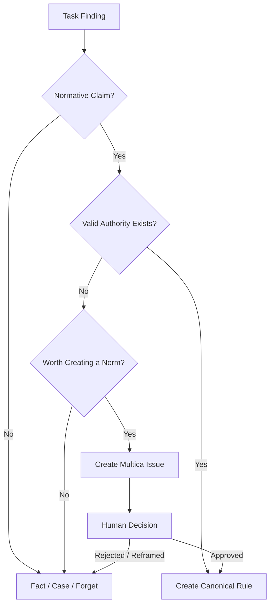

## 7.5 Scope、Applicability、Role Activation 分离

- Scope：对谁成立；
- Applicability：在什么条件下生效；
- Role Activation：当前谁需要看到。

优先结构化 Applicability：

```yaml
applicability:
  project_phases: []
  repos: []
  domains: []
  components: []
  task_types: []
  roles: []
  semantic_conditions: []
```

结构化条件由固定规则判断；无法结构化的场景条件由 LLM 有界判断。

## 7.6 Rule Exception

Scope specificity 不拥有自动 Override Authority。

禁止：

```text
Project Rule automatically overrides Team Rule
```

第一版建议：

```yaml
exception_policy:
  mode: none | explicit
```

- `none`：不能通过低 Scope 自行建立例外；
- `explicit`：允许建立明确 Exception，但必须有合法 Authority Source。

Exception 使用：

```yaml
exception_of: TEAM-RULE-017
authority_ref: multica://issue/253
```

## 7.7 Rule Lifecycle

```text
active
review_needed
superseded
revoked
```

Reality 违反 Rule 不会让 Rule 自动进入 `review_needed`。

正确表示：

```yaml
rule:
  status: active
fact:
  status: active
relation:
  type: norm_reality_conflict
```

---

# 8. Current Fact

## 8.1 定义

> **Current Fact = 当前已验证、会影响未来多个 Task，并且不适合每次都低成本可靠重新调查的 Scoped Reality。**

Current Fact 可以存在于：

```text
Team
Cross-project
Project
```

## 8.2 三重门

```text
1. 当前已验证？
2. 是否跨 Task 有开发价值？
3. 是否难以低成本、可靠从当前 Source 重建？
```

只有三者都满足才进入 Canonical Current Fact。

### Easy Recoverable

通常：

```text
单 Repo
+
明确 path / symbol / config key
+
current main 可直接查询
+
无需历史原因
+
无需多 Source 组合
```

默认 Pointer / Forget。

### Hard Recoverable

例如：

- 跨 Repo；
- Code + ADR + Config 联合判断；
- 需要 Git History；
- 需要业务语义；
- Ownership 判断；
- 异步链路组合；
- 多模块 / 状态机联合理解。

## 8.3 Fact Lifecycle

```text
active
review_needed
superseded
```

Source Change 是主要 Trigger。

### Machine View

```yaml
fact_revalidation:
  trigger:
    - source_change
    - conflicting_evidence
    - context_challenge
  active_to_review_needed:
    fixed_checks:
      - dependency_match
      - scope_match
      - revision_change
    semantic_check: source_change_impacts_claim
  revalidate:
    still_true: active
    new_reality:
      old: superseded
      new: active
    historical_value: convert_to_case
    no_future_value: pointer_or_forget
```

### Human View

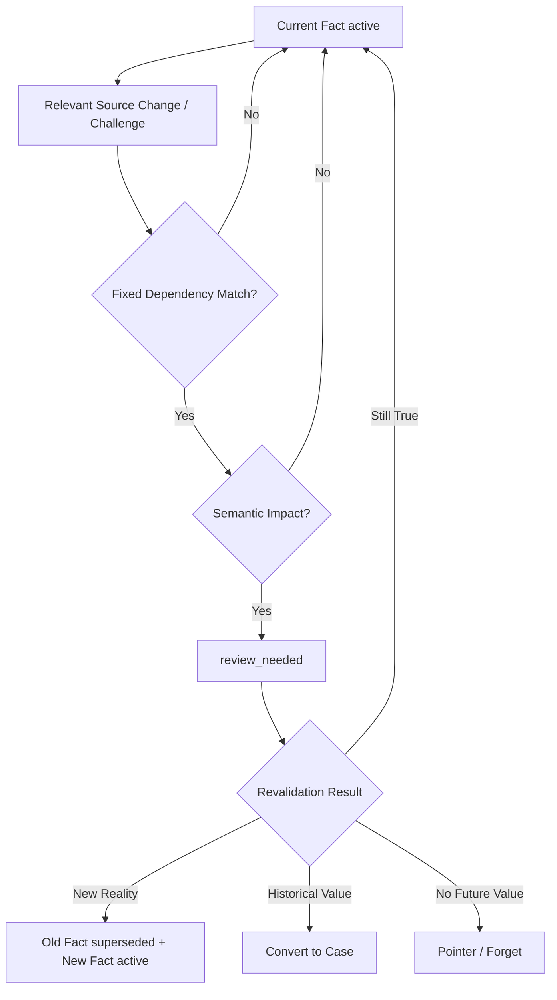

---

# 9. Case

## 9.1 定义

> **Case = 具有明确 Scope、历史场景和角色相关性的低 Authority 经验记忆，只在相似场景下用于参考、风险提示、Why 或 precedent。**

建议字段：

```yaml
case_id:
scope:
context:
problem_or_trigger:
action_or_behavior:
outcome:
why_it_matters:
applicable_when:
not_applicable_when:
relevant_roles:
source_refs:
status:
```

## 9.2 Case Lifecycle

只需要：

```text
active
review_needed
```

Case 不需要 `superseded`。

后来出现新的 Case 不会让旧历史“不曾发生”。

Case → Rule 也不是生命周期升级，而是 Rule Discovery：

```text
Case
→ Rule Discovery
→ New Finding / Rule Candidate
```

原 Case 仍可作为 Why / precedent。

---

# 10. Task Finding

Finding 是当前 Task 中发现的新认知，是临时转换对象。

最小结构：

```yaml
finding_id:
project_id:
task_id:
summary:
source_refs:
discovered_by:
created_at:
verification:
disposition:
status:
```

Finding lifecycle 只需要：

```text
open
processed
```

真正重要的是：

```text
verification
+
disposition
```

Finding 不长期堆积。

---

# 11. Context Checkpoint

## 11.1 定义

Checkpoint 是：

> **当前认知状态的滚动恢复点。**

Checkpoint 不是：

- Project Progress；
- Task Tracker；
- 历史 Memory 库；
- Issue Queue。

Checkpoint 不需要独立 lifecycle status。

## 11.2 两层模型

正式采用：

```text
1 × Team Checkpoint
N × Project Checkpoint
```

不建立：

```text
Task Checkpoint
Repo Checkpoint
Cross-project Checkpoint
Role Checkpoint
```

## 11.3 Project Checkpoint

一个非 Archived Project 一个滚动 Project Checkpoint。

回答：

> 这个 Project 当前的认知状态是什么？

建议：

```yaml
confirmed:
open:
conflicts:
next:
refs:
```

其中 `confirmed` 只保留理解当前 `open / conflicts / next` 所需要的近期前提，不复制稳定 Fact / Rule / Anchor。

Project Archived 后停止更新，最后 Git 版本自然成为最终认知恢复快照。

## 11.4 Team Checkpoint

回答：

> 整个团队当前的认知状态是什么？

可包含：

```yaml
projects:
confirmed:
open:
conflicts:
next:
refs:
```

Team Checkpoint 可以呈现各 Project 的一级状态，但不展开 Project 内部细节。

原则：

> **上层负责态势，下层负责细节。**

## 11.5 Project Registry 与 Team Checkpoint 防双写

Project Phase 的 Canonical Source 是 Project Registry。

Team Checkpoint 中显示的 Project Phase / context status 属于 derived / materialized presentation，不是第二 Authority Source。

### Machine View

```yaml
team_checkpoint:
  project_status_source: project_registry
  projects:
    project_a:
      phase_ref: registry://project-a
      context_status: normal
      checkpoint_ref: project://project-a/checkpoint
    project_b:
      phase_ref: registry://project-b
      context_status: attention_required
      checkpoint_ref: project://project-b/checkpoint
  open:
    - claim: cross_project_ownership_unresolved
      projects: [project_a, project_b]
      issue_ref: multica://issue/312
```

### Human View

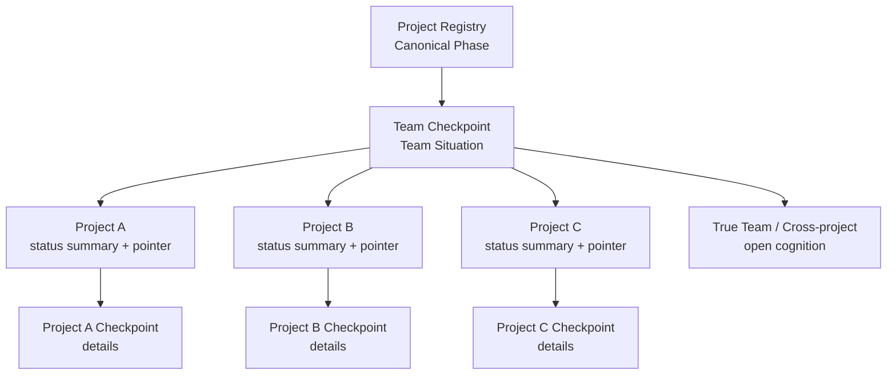

---

# 12. Project Registry 与 Project Lifecycle

## 12.1 Project Registry

推荐最小字段：

```yaml
project_id:
phase:
context_repo:
status_refs:
```

Project Phase 由 Human / Engineering Lead 决定；Context Engineer 消费该状态。

## 12.2 Project Lifecycle

第一版正式采用：

```text
Incubation
→ Active Development
→ Maintenance / Operations
→ Deprecated
→ Archived
```

`Release` 不作为长期 Phase，而作为 Milestone / Event。

## 12.3 Lifecycle 影响 Context Policy，不批量改 Memory Truth

Phase Change 主要改变：

```text
Active Role Set
Retrieval Profile
Retention Policy
Checkpoint Write Policy
Grooming / Promotion Trigger
```

而不是批量：

```text
Fact → stale
Rule → revoked
Case → archive
```

### Machine View

```yaml
phase_policy_effects:
  incubation:
    retrieval_focus: [anchor, team_rules, cross_project_dependencies, exploratory_evidence]
    checkpoint_writable: true
    retention_mode: conservative
  active_development:
    retrieval_focus: [architecture, ownership, development_rules, current_facts, checkpoint]
    checkpoint_writable: true
    retention_mode: normal
  maintenance:
    retrieval_focus: [runtime_facts, compatibility, deployment, monitoring, recovery, operational_rules, incident_cases]
    checkpoint_writable: true
    retention_mode: normal
  deprecated:
    retrieval_focus: [safe_maintenance, compatibility, migration, decommission, operational_risk]
    checkpoint_writable: true
    retention_mode: conservative
    triggers: [promotion_review]
  archived:
    retrieval_mode: historical_only
    checkpoint_writable: false
    capture_policy: closed
```

### Human View

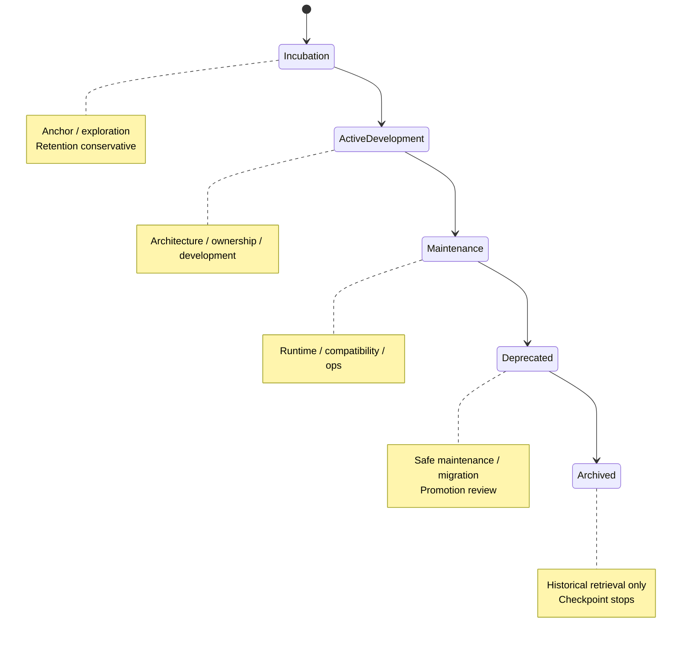

## 12.4 Archived 语义

Project Archived 后：

- Project Memory 默认退出 Active Retrieval；
- Project Checkpoint 停止滚动；
- Project Rules 不再参与日常 Active Project Retrieval；
- Project Current Facts 不再作为当前活跃系统 Reality；
- Case 默认 Historical-only。

但不批量：

```text
Rule → revoked
Fact → superseded
```

这些行为由 Project Phase 推导，不重复写入对象状态。

Archived Project 中原 Current Fact 的语义变为：

> last verified reality of the archived project at its active period

---

# 13. Claim / Evidence / Authority 模型

## 13.1 Claim-centric

系统先判断：

> 当前要验证 / 保存 / 使用的 Claim 是什么？

再判断：

> 什么 Evidence 支持它？谁有 Authority 定义它？

正式区分四类 Claim：

```text
Governance Claim
Normative Claim
Current Reality Claim
Historical / Explanatory Claim
```

## 13.2 Evidence

Evidence 是：

> 用于支持、反驳或限定 Claim 的可追溯信息。

可能来自：

```text
Code
Config
Runtime
Test
ADR
Contract
Issue
Git History
Docs
Human Decision
Agent Inference
```

## 13.3 Authority

Authority 表示：

> 某 Decision Source 是否有资格定义某类 Governance / Normative Claim。

Authority 绑定 recognized decision artifact，不绑定 Agent Role 排名。

## 13.4 不存在全局 Evidence Ranking

禁止：

```text
Human > ADR > Code > Docs > LLM
```

这样的统一序列。

Current Reality 更关心：

```text
directness
revision
scope
currentness
```

Norm / Governance 更关心：

```text
recognized authority source
```

## 13.5 Evidence 最小结构

```yaml
source_ref:
source_type:
scope:
revision_or_version:
observed_at:
claim_relation:
```

`claim_relation`：

```text
supports
contradicts
qualifies
```

Verification 使用：

```text
verified
partially_verified
unverified
conflicted
refuted
```

不使用 `confidence = 0.xx` 一类伪精确分数。

---

# 14. Conflict 模型

## 14.1 Conflict 是合法状态

系统不追求通过更多 Agent 或更多 LLM 推理强制消除所有 Conflict。

## 14.2 Evidence Conflict

针对同一个 Reality Claim：

```text
Evidence A → Owner = business
Evidence B → Owner = resource
```

可以表示：

```yaml
fact:
  status: review_needed
  verification: conflicted
```

如果当前 Task 依赖该结论且机器无法继续验证，则创建 Multica Issue。

## 14.3 Norm / Reality Conflict

例如：

```text
Rule: 不得 bypass Gateway
Reality: 当前正在 bypass Gateway
```

两者可以同时为真：

```yaml
rule:
  status: active
fact:
  status: active
relation:
  type: norm_reality_conflict
```

不静默修改任何一方。

## 14.4 Lifecycle / Verification / Relation / Workflow 分离

禁止：

```yaml
status: blocked_conflicted_waiting_human
```

正确：

```yaml
status: review_needed
verification: conflicted
relations:
  conflict_with: []
blocked_by:
  - multica://issue/253
```

四个维度：

```text
Lifecycle
Verification
Relation
Multica Workflow
```

---

# 15. Multica Issue：Human Decision Escalation

Context System 不建立自己的 Decision Queue，直接复用 Multica Issue。

## 15.1 什么时候创建 Issue

典型：

- Rule / Rule Conflict 无法自动判断；
- Norm / Reality Conflict 需要 Governance Decision；
- Evidence Conflict 无法进一步调查；
- 新 Rule 需要 Authority；
- Anchor Governance 需要改变；
- Project Archive 与 Active Dependency 冲突；
- Authority Scope 无法确认。

## 15.2 阻塞原则

只有真正依赖该决策的 Task / Subtask / Decision Path 才 blocked。

禁止：

```text
一个局部 Issue → 整个 Project 无差别 blocked
```

## 15.3 Issue 生成内容

建议至少：

```yaml
question:
why_machine_cannot_resolve:
evidence_refs:
conflict_summary:
affected_scope:
dependent_tasks:
options:
ai_recommendation:
recommendation_reason:
```

## 15.4 Issue Closure

Issue `closed` 本身不代表某个默认方案被批准。

系统必须读取明确 Decision Outcome。

若没有明确结论：

```text
仍保持 unresolved
```

## 15.5 Human Decision 与 Authority

Human 的明确 Governance / Normative Decision 可以成为新的 Authority Source，例如：

```yaml
authority_ref: multica://issue/253
authority_type: human_decision
scope: project-b
status: active
```

但 Human Decision 不能直接改变物理 Reality；Reality 仍需要 Evidence 验证。

### Machine View

```yaml
human_escalation:
  trigger: unresolved_after_fixed_and_llm
  pre_issue:
    - deduplicate
    - merge_related
    - prioritize
  if_current_work_blocked:
    issue_creation: immediate
  else:
    issue_creation: periodic_prioritized
  workflow:
    - create_multica_issue
    - mark_true_dependencies_blocked
    - wait_for_explicit_decision
    - consume_decision
    - update_canonical_context
    - unblock_dependencies
```

### Human View

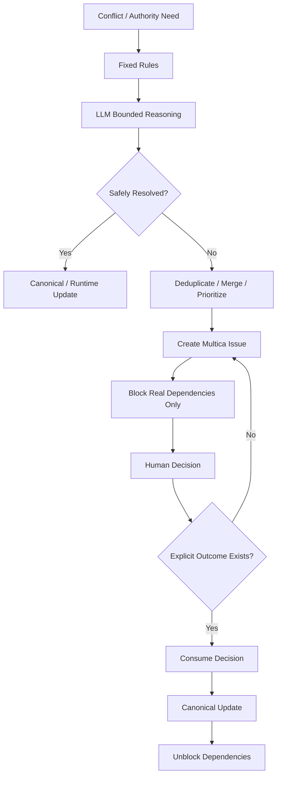

---

# 16. Role Context Profile

## 16.1 定义

> **Role Context Profile = 一个稳定角色在执行任务时，从统一 Context & Memory System 中获取什么上下文、优先什么、什么时候扩展检索的策略。**

Role 不拥有自己的动态 Memory 副本。

建议结构：

```yaml
role:
responsibilities:
authority_boundary:
retrieval_policy:
  baseline_context:
  preferred_memory:
  conditional_memory:
  default_exclude:
  priority:
```

`baseline_context` 取代 `always_context`，避免实现者理解成无条件全量注入。

Role Filter 是默认 Retrieval Policy，不是硬 ACL。

## 16.2 Role Activation 与 Role Retrieval 分离

- Role Activation：当前 Task / Project Phase 是否需要该角色；
- Role Retrieval：角色进入后应该获取什么 Context。

Project 可通过 Phase Policy + Project Override 定义：

```yaml
active_roles: []
on_demand_roles: []
```

## 16.3 七个角色基本定位

### Engineering Lead

重点：

```text
Team Checkpoint
Project status
Anchor
Blocking Issues
High-impact Rules / Facts
```

### Context Engineer

重点：

```text
Team / Project Checkpoint
Anchor
Rules
Facts
Case metadata
Findings
Evidence
Conflict
Lifecycle
```

### Architect

重点：

```text
Anchor
Architecture Rules
Architecture / Ownership Facts
Contracts
Architecture Cases
```

### Software Engineer

重点：

```text
Anchor digest
Task Scope
Project Checkpoint relevant slice
Rules
Relevant Current Facts
Task Evidence
```

### Feature Reviewer

重点：

```text
Anchor
Target Users
Scope / Non-goals
Product Behavior Facts
Product / Feature Rules
Relevant Historical Cases
```

### QA

按阶段 / 风险激活，重点：

```text
Acceptance / Quality Rules
Risk Slice
Current Behavior
Test / Runtime Evidence
Defect / Regression Cases
```

### Ops / SRE

Maintenance 后重点：

```text
Runtime Facts
Deployment
Compatibility
Monitoring
Recovery
Operational Rules
Incident Cases
```

---

# 17. Case Activation Policy

## 17.1 Retention 与 Activation 分离

Case 值得长期保存，不代表应该频繁进入 Task Context。

普通 Task：

```text
Case Activation = 0
```

是正常结果。

## 17.2 Activation Pipeline

```text
Hard Eligibility
→ Activation Need
→ Scenario Match
→ Rule / Fact Coverage
→ Decision Value
→ Context Budget
```

## 17.3 Hard Eligibility

至少：

```text
Scope
Case Status
Project Lifecycle
```

Archived / unrelated Project Case 默认排除。

## 17.4 Case Search Need

普通：

```text
CRUD
简单字段修改
明确小 bug
已有 Rule 足以指导
```

默认不启动 Case Search。

更可能启动：

```text
Architecture Design
Major Technical Choice
Complex Cross-repo Change
Performance Issue
Incident
Repeated Problem
Major Compatibility Change
Migration
Multiple Reasonable Options
Explicit Historical Search
```

## 17.5 Task Risk

Risk 改变 Case Search Breadth，不改变 Case Authority。

## 17.6 Scenario Match

LLM 至少判断：

```text
Trigger similarity
Decision type similarity
Constraint similarity
not_applicable_when hit
```

第一版建议保守输出：

```text
match
no_match
```

不确定时默认 `no_match`。

## 17.7 Rule / Fact Coverage

如果 Relevant Rule / Current Fact 已足够指导当前 Task：

```text
Case 默认不注入
```

Case 主要补充：

```text
Why
Precedent
Scenario Calibration
Exception Analysis
```

## 17.8 Activation Trace

运行时保留：

```yaml
case_ref:
activation_reason:
```

用于后续 False Activation 校准。

### Machine View

```yaml
case_activation:
  hard_filters:
    - scope_match
    - status_active
    - lifecycle_allowed
  activation_need:
    role_policy: true
    task_intent: relevant
    task_risk: adjust_search_breadth
  scenario_match:
    output: [match, no_match]
    uncertain_default: no_match
  coverage_check:
    if_rule_or_fact_sufficient: skip_case
  runtime_trace:
    activation_reason: required
```

### Human View

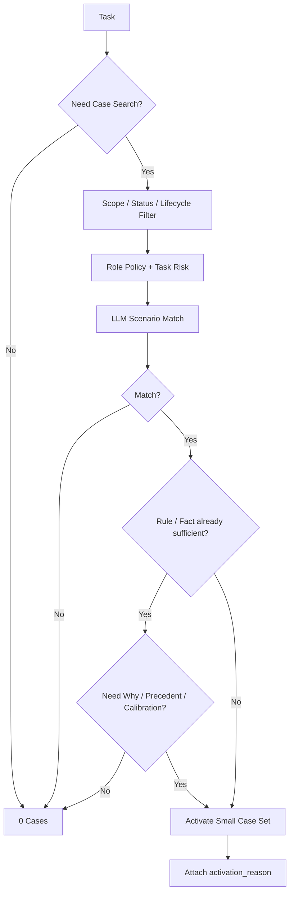

---

# 18. Promotion / Demotion

正式区分三类动作：

```text
Canonicalization
Scope Promotion / Correction
Semantic Transition
```

## 18.1 Canonicalization

Task Finding 经过 Verify / Retention 后进入 Canonical Memory，不叫 Scope Promotion。

## 18.2 Scope Promotion

例如：

```text
Project Fact → Team Fact
Project Case → Team Case
```

Cross-project 不是中间晋升级别。

Promotion Threshold 必须高于 Retention Threshold。

重复出现只触发 Promotion Review，不能证明 Team Universality。

Promotion 必须同时验证：

```text
Claim Validity
+
Scope Validity
```

## 18.3 Rule Scope Expansion

Project Rule → Team Rule 属于 Authority 扩张。

没有 Team-level Authority 时必须通过 Multica Issue / Human Decision。

## 18.4 Fact / Case Promotion

Evidence 与 Scope Evidence 充分时可以自动完成，但必须严格防 Scope Pollution。

## 18.5 Single Canonical Source

Promotion 后：

```text
New Scope Canonical = 唯一正文
Old Scope = Pointer / Reference
```

若 Project 仍有特殊语义，则保留 Project-specific Exception / Special Fact，而不是复制通用正文。

## 18.6 Scope Correction

如果原 Team Scope 后来被证明过宽，例如只有 A/B 成立：

```text
Team Fact → Cross-project Fact[A,B]
```

这叫 Scope Correction。

## 18.7 Project Exception

Team Rule 仍成立但 Project 有合法例外：

```text
Team Rule active
+
Project Exception
```

不是 Team Rule Demotion。

## 18.8 Semantic Demotion

典型：

```text
Current Fact → Case
```

只在旧 Reality 仍有历史场景价值时；否则 Pointer / Forget。

### Machine View

```yaml
scope_promotion:
  trigger: promotion_review
  gates:
    - claim_validity
    - scope_validity
    - project_specific_conditions_removed
    - future_decision_value
    - misuse_risk_acceptable
  rule_scope_expansion:
    requires_authority: true
  fact_case_scope_expansion:
    auto_allowed_when_evidence_sufficient: true
  canonical_policy:
    single_source_of_truth: true
    old_scope_behavior: pointer_or_reference
```

### Human View

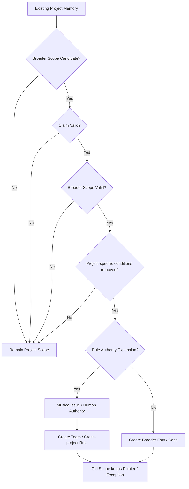

---

# 19. Memory Grooming

## 19.1 定义

> **Memory Grooming = 对已经进入 Context System 的 Canonical Memory 进行校验、降噪、合并、降级和 Scope 调整，使当前可被召回的认知保持高精度。**

Grooming 不重新承担 Finding Capture。

## 19.2 Correctness 与 Hygiene 分离

```text
Source Change → targeted correctness revalidation
Grooming → long-term hygiene
```

不能等待周期 Grooming 才处理已知 Source Change。

## 19.3 Trigger

主要：

```text
Project Lifecycle Transition
Major Refactor
Major ADR / Ownership / Contract Change
False Activation
Repeated Context Challenge
Duplicate Accumulation
Repeated Stale Retrieval
Low-frequency Periodic Hygiene
```

## 19.4 Actions

限制为：

```text
Validate
Merge
Supersede
Demote
Compress
Pointer / Forget
Promote Scope
```

Reality / Retention 可以较高程度自动化。

Norm / Governance 不允许 Grooming 自行改变 Authority。

## 19.5 Case Grooming

重点：

```text
真实性
Scenario Boundary
Duplicate
Rule Coverage
False Activation
Independent Explanatory Value
```

目标不是压缩 Case 总数，而是提高 Case Activation Precision。

### Machine View

```yaml
grooming:
  triggers:
    - project_phase_transition
    - major_context_change
    - false_activation
    - repeated_context_challenge
    - duplicate_accumulation
    - periodic_hygiene
  scope_first: true
  actions:
    - validate
    - merge
    - supersede
    - demote
    - compress
    - pointer_or_forget
    - promote_scope
  authority_boundary:
    reality_retention_changes: bounded_auto
    normative_governance_changes: authority_required
```

### Human View

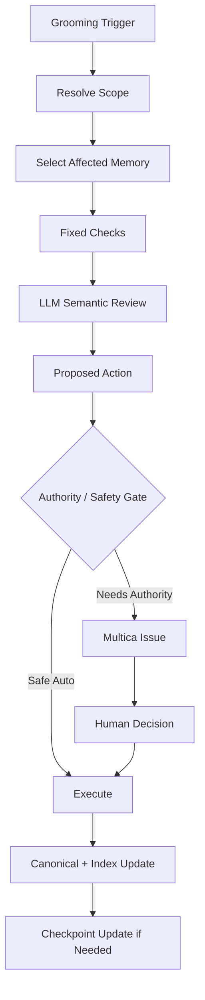

---

# 20. Source Change 与 Revalidation

Source-change propagation 必须限制影响范围。

禁止：

```text
Repo has commit
→ all related facts review_needed
```

正确：

```text
Source Change
→ Dependency Match
→ Deterministic Narrowing
→ Semantic Impact Check
→ Only Affected Memory review_needed
```

第一层可使用：

```text
repo
path
symbol
contract
config key
domain
```

## 20.1 Retrieval 不每次重验全部 Evidence

整体装配后的重要修正：

> Active Canonical Memory 默认信任最近一次有效 Verification。

正常 Retrieval 只做：

```text
status check
scope check
source metadata / revision hook check
applicability check
```

完整 Evidence Revalidation 只在：

```text
review_needed
source-change impact
Context Challenge
high-risk decision
explicit verification task
conflicting Evidence
```

时触发。

### Machine View

```yaml
source_change_pipeline:
  input: source_change_event
  deterministic_filter:
    - repo
    - path
    - symbol
    - contract
    - config_key
    - domain
  semantic_impact_check: true
  affected_only: true
  output:
    impacted_memory: review_needed
    unaffected_memory: unchanged
```

### Human View

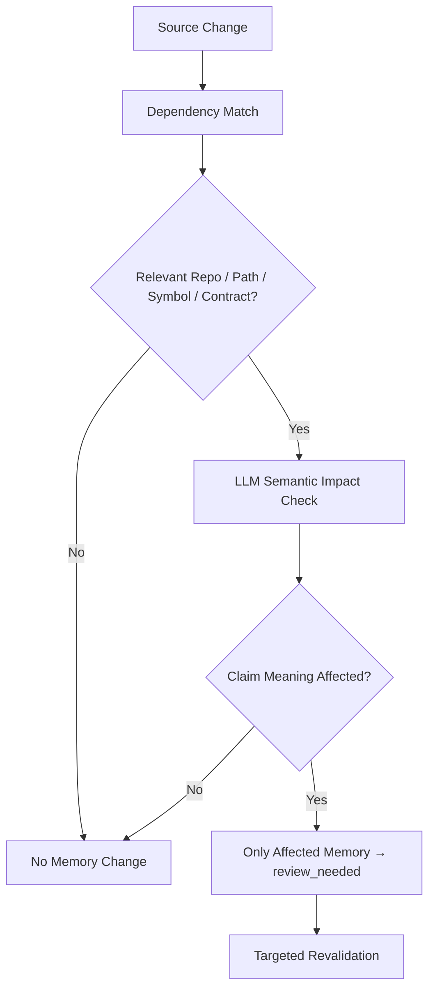

---

# 21. 完整 Task Context Assembly

这是整个系统的主要运行入口。

## 21.1 Machine View

```yaml
task_context_assembly:
  input:
    - multica_task_or_issue
    - active_role
  steps:
    - resolve_task_scope
    - resolve_project_or_cross_project_scope
    - read_project_phase_from_registry
    - resolve_role_activation
    - load_role_context_profile
    - load_project_anchor_baseline
    - load_project_checkpoint_relevant_slice
    - load_team_checkpoint_relevant_slice_if_needed
    - strict_scope_filter
    - lifecycle_and_verification_filter
    - retrieve_applicable_rules
    - retrieve_relevant_current_facts
    - decide_case_search_need
    - case_scope_role_scenario_risk_activation
    - attach_task_evidence
    - attach_open_conflicts_and_blocking_issue_refs
    - authority_and_type_priority
    - apply_context_budget
  output: task_context_package
  failure:
    scope_unresolved:
      action: multica_issue_if_needed
      dependent_work: blocked
```

## 21.2 Human View

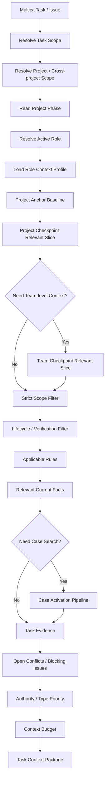

## 21.3 Scope 失败

如果 Task Scope 无法安全确定：

```text
不得先全局 Semantic Search 再让 LLM 猜 Project
```

必须先解决 Scope。

真正阻塞时创建 Multica Issue，并阻塞相关工作。

---

# 22. Task Context Package

建议运行时结构：

```yaml
task:
role:
scope:
project_phase:
anchor_digest:
team_state_slice:
project_state_slice:
rules:
current_facts:
cases:
open_conflicts:
blocked_by:
task_evidence:
source_refs:
```

Case 可附带：

```yaml
activation_reason:
```

Rule / Fact 应清楚暴露：

```text
status
verification
authority/source refs
```

Task Context Package 是 Runtime Artifact，不写回 Canonical Memory。

---

# 23. Agent Work → Finding / Context Challenge

Agent 在任务中可以产生：

```text
Task Finding
Context Challenge
```

Context Challenge 表示：

> Agent 发现现有 Memory 可能错误、过时、不完整、误激活或存在冲突。

Agent 无权：

```text
直接覆盖 Canonical Rule
直接修改 Anchor Governance
静默修正 Authority Data
```

必须进入正常 Verify / Grooming / Issue 流程。

---

# 24. Finding → Retention Decision

## 24.1 Machine View

```yaml
finding_retention:
  input: finding
  branches:
    unresolved_current_work_relevant:
      target: checkpoint
    refuted_duplicate_noise_absorbed:
      disposition: forget
    normative_or_governance:
      authority_exists:
        target: rule_or_anchor_update
      authority_missing:
        worth_norm_creation:
          action: multica_issue
        otherwise:
          disposition: fact_or_case_or_forget
    current_reality:
      cross_task_value: required
      easy_recoverable:
        disposition: pointer_or_forget
      hard_recoverable:
        target: current_fact
    historical:
      scenario_role_value:
        target: case
      otherwise:
        disposition: pointer_or_forget
  post_process:
    - scope_promotion_review_if_triggered
    - mark_finding_processed
```

## 24.2 Human View

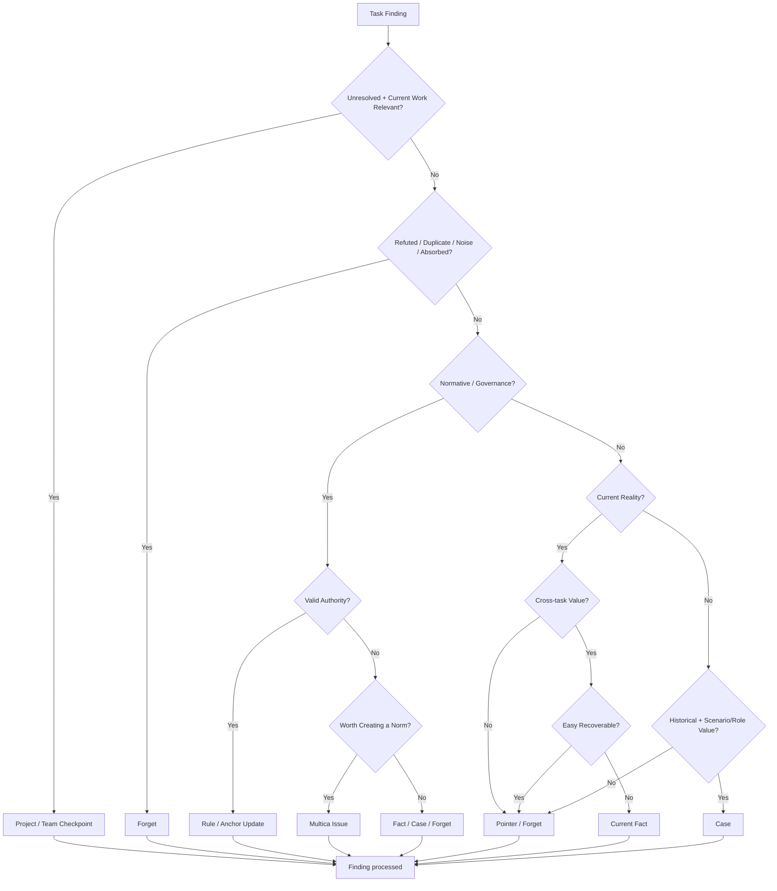

---

# 25. Checkpoint 更新与 Scope 归属

## 25.1 归属规则

```text
只属于一个 Project 的当前认知
→ Project Checkpoint

真正 Team / Cross-project Scope 的当前认知
→ Team Checkpoint
```

原则：

> **详细认知只在最低合理 Scope 保存一次，上层只保存态势摘要与 Pointer。**

## 25.2 Interaction

### Machine View

```yaml
checkpoint_routing:
  input: unresolved_cognition
  if_single_project_scope:
    primary: project_checkpoint
    team_checkpoint: status_summary_or_pointer_only
  if_team_or_cross_project_scope:
    primary: team_checkpoint
    related_project_checkpoints: pointer_only
  resolved:
    remove_from_checkpoint: true
    canonicalize_if_long_term_value: true
```

### Human View

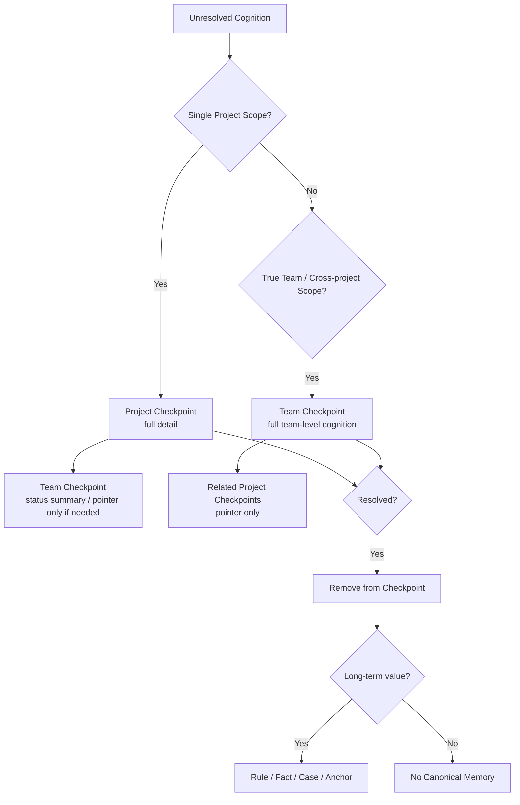

---

# 26. Canonical Update 与 Index Update

Canonical 更新后：

```text
Canonical Git Write
→ Validation
→ Derived Index Update
```

Derived Layer 至少使用：

```text
Scope
Type
Status
Verification
Role tags
Scenario metadata
Source refs
Relations
```

Agent 不需要理解 Vector / BM25 / Graph 等内部实现。

Agent 只消费 Memory Contract / Task Context Package。

### Machine View

```yaml
canonical_write_pipeline:
  - canonical_git_write
  - schema_validation
  - source_ref_validation
  - authority_validation_if_required
  - index_update
  - retrieval_cache_invalidate_if_needed
```

### Human View

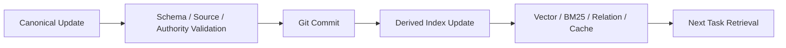

---

# 27. 完整系统闭环

## 27.1 Machine View

```yaml
multica_context_memory_loop:
  governance:
    team_context:
      - project_registry
      - team_checkpoint
      - team_rules
      - team_facts
      - team_cases
    project_context:
      - project_anchor
      - project_checkpoint
      - project_rules
      - project_facts
      - project_cases
  runtime:
    - task_scope_resolution
    - role_resolution
    - context_retrieval
    - task_context_package
    - agent_work
    - finding_or_context_challenge
    - verification
    - retention_decision
  outputs:
    canonical_memory: [anchor, rule, fact, case]
    rolling_context: [team_checkpoint, project_checkpoint]
    human_escalation: multica_issue
    discard: [pointer, forget]
  maintenance:
    - source_change_revalidation
    - grooming
    - promotion_review
    - index_update
```

## 27.2 Human View

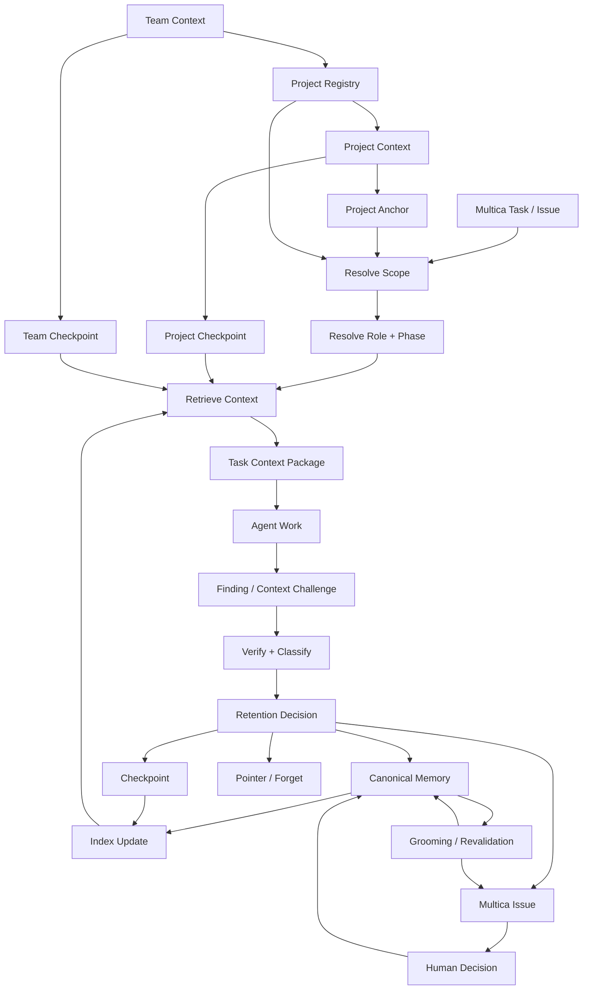

---

# 28. 重要决策记录（Decision Register）

本节记录对架构有长期影响的重要取舍，避免后续实现阶段重新走回已否决方案。

## D-01：系统对象从“单项目 Memory”升级为长期团队 Context System

**决策**：系统服务长期存在的 AI 开发团队，管理多个 Project 和多个生命周期。

**原因**：角色、Project、运营阶段都会变化，单 Project 大知识库无法稳定表达 Scope 与生命周期。

---

## D-02：Scope 是硬边界，必须先于 Semantic Search

**决策**：不同 Project 默认硬隔离；禁止全局 Vector Search 后再让 LLM 判断归属。

**原因**：Scope Pollution 是高风险错误，语义相似不能赋予跨 Project 合法性。

---

## D-03：Role 不拥有动态 Project Memory

**决策**：Role 只保存职责、Authority Boundary、Retrieval Policy。

**原因**：动态 Project Knowledge 写入 Role 会造成多副本和状态漂移。

---

## D-04：Project Anchor 成为一等 Project Context Anchor

**决策**：`project.yaml` 不只是 Metadata，而是 Project Governance Baseline。

**原因**：Agent 进入 Project 必须先知道 Project 是什么、什么属于 Scope、什么不属于 Scope。

---

## D-05：Current Fact 与 Rule 严格分离

**决策**：Current Fact 描述 Reality；Rule 描述未来应该如何行动。

**原因**：当前代码 Pattern 不能自动获得 Normative Authority。

---

## D-06：Evidence 与 Authority 分离

**决策**：不做统一 Evidence Ranking；Claim Type 决定 Evidence / Authority 的使用方式。

**原因**：Code 对 Reality 很强，但对 Norm 没有自动 Authority；ADR / Human Decision 可能定义规范，却不一定描述当前 Reality。

---

## D-07：允许 Conflict 与 Uncertainty 长期存在

**决策**：系统不保证所有冲突均可由机器自动解决。

**原因**：设计目标不是构造完美模型，而是安全暴露无法自动判断的问题。

---

## D-08：Human Decision 复用 Multica Issue

**决策**：不建立独立 Decision Queue；Context Engineer 创建 Multica Issue，依赖项 blocked，等待 Human Decision。

**原因**：Multica 已提供 Issue / dependency 机制；Context System 不应演化成新的 Project Management System。

---

## D-09：Blocked / Conflict / Waiting Human 不进入 Memory lifecycle status

**决策**：Lifecycle、Verification、Relation、Workflow 四个维度分离。

**原因**：避免状态枚举爆炸和语义混乱。

---

## D-10：Rule Candidate 不进入 Canonical Rule lifecycle

**决策**：没有 Authority 前仍停留 Finding / Multica Issue 层。

**原因**：Capture ≠ Canonical Write；Candidate 不是低状态 Rule。

---

## D-11：Checkpoint 采用 Team + Project 两层

**决策**：一个 Team Checkpoint；每个非 Archived Project 一个 Project Checkpoint。

**原因**：Team 回答团队当前状态；Project 回答项目当前状态。更细粒度没有独立价值。

---

## D-12：Team Checkpoint 可呈现 Project 一级状态，但不保存项目细节

**决策**：上层负责态势，下层负责细节；Project Phase 仍以 Registry 为 Canonical Source。

**原因**：既满足团队态势恢复，又避免 Project 状态双写和复制。

---

## D-13：Checkpoint 不需要独立 lifecycle status

**决策**：Project Archived 后停止更新 Checkpoint，不引入 `frozen`。

**原因**：可从 Project Phase 确定性推导，不应重复保存。

---

## D-14：Release 不作为第一版长期 Project Phase

**决策**：Release 作为 Milestone / Event；长期 Phase 收敛为 Incubation → Active Development → Maintenance → Deprecated → Archived。

**原因**：Phase 表达长期工作模式，Release 通常是时间点事件。

---

## D-15：Project Phase 改变 Context Policy，而不是批量改变 Memory Truth

**决策**：Phase Change 主要影响 Role / Retrieval / Retention / Grooming。

**原因**：上线、维护、归档不会自动让每条 Fact / Rule 变错或失效。

---

## D-16：Case Activation Precision 优先于 Case 总量

**决策**：Case Retention 与 Activation 分离；普通 Task 可以 0 Case。

**原因**：大量 Case 本身不危险，错误 Activation 才会污染决策上下文。

---

## D-17：Case Search 本身是条件化行为

**决策**：普通 CRUD / 明确小 bug 默认不启动 Case Search；架构、迁移、故障、高风险场景才扩大。

**原因**：避免每个 Task 固定向量检索历史案例。

---

## D-18：Promotion Threshold 高于 Retention Threshold

**决策**：Project Memory 值得保留不代表值得进入 Team Scope。

**原因**：错误 Promotion 会造成 Scope Pollution，风险高于少存一条 Team Memory。

---

## D-19：Cross-project 不是 Project → Team 的中间晋升级别

**决策**：Cross-project 是独立 Scope。

**原因**：只对一组 Project 成立的关系并不天然趋向 Team 通用性。

---

## D-20：Promotion 后 Single Canonical Source

**决策**：Scope Promotion 后旧 Scope 保留 Pointer / Reference，不复制正文。

**原因**：避免跨 Scope 双写与漂移。

---

## D-21：Source-change Revalidation 与 Grooming 分离

**决策**：Source Change 负责 targeted correctness；Grooming 负责长期 hygiene。

**原因**：正确性不能依赖低频周期整理。

---

## D-22：Retrieval 不每次完整重验 Evidence

**决策**：Active Canonical 默认信任最近一次有效 Verification。

**原因**：如果每个 Task 都重新打开代码 / ADR / Runtime 验证所有 Memory，长期 Context System 会退化为重复研究系统。

---

# 29. 第一版实现优先级

当前概念模型已经闭合，后续实现应优先跑通最小完整闭环，不继续增加 Memory Type。

建议顺序：

```text
1. Project Registry
2. Team / Project Checkpoint
3. Project Anchor
4. Role Context Profile
5. Rule / Fact / Case Canonical Schema
6. Finding Pipeline
7. Scope-first Retrieval
8. Task Context Package Builder
9. Evidence / Verification Metadata
10. Multica Issue Escalation
11. Source-change Review Hook
12. Basic Grooming
13. Promotion Review
14. Derived Index Optimization
```

Vector、复杂 Graph、高级 Re-ranking、自动关系抽取等属于第二阶段优化，不应阻塞最简模型。

---

# 30. 第一批真实 Task 实验

不需要先建立大规模人工标注集。

直接运行真实 Multica Project / Task：

### Machine View

```yaml
first_batch_experiment:
  flow:
    - real_multica_task
    - auto_context_assembly
    - agent_work
    - auto_finding_capture
    - policy_engine_hard_rules
    - llm_bounded_judgment
    - canonical_or_checkpoint_or_issue_disposition
    - human_batch_review
  metrics:
    highest_priority:
      - false_canonical
      - scope_pollution
      - false_activation
    secondary:
      - false_forget
      - reinvestigation_cost
      - issue_noise
```

### Human View

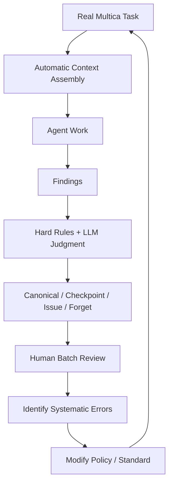

重点观察：

### False Canonical

不该进入 Canonical，却进入了。

最高优先级修正。

### Scope Pollution

Project A 的知识错误进入 B / Team。

严重错误。

### False Activation

Memory 合法存在，但在错误 Role / Scenario 被召回。

### False Forget

应保留却丢弃。

允许一定比例，因为 Source 通常仍可重新调查。

### Re-investigation Cost

系统是否因为过度保守造成明显重复调查。

### Issue Noise

Context Engineer 是否创建了过多无必要 Human Issue。

---

# 31. 后续实现时必须保持的边界

1. 不因实现方便把所有状态塞回一个 `status` 字段；
2. 不因 Vector Search 方便破坏 Scope-first；
3. 不把 Multica Issue 全文复制进 Memory；
4. 不把 Team Checkpoint 变成所有 Project Checkpoint 的大汇总；
5. 不把 Project Registry 与 Team Checkpoint 同时当 Project Phase Authority；
6. 不把 Rule Candidate 作为可被普通 Task 召回的低等级 Rule；
7. 不把 Case 使用次数作为 Authority / Activation 的主要来源；
8. 不把 Source Change 简化成“Repo 有 commit → 全量 stale”；
9. 不为了减少 Case 数量而丢失 Scenario Boundary；
10. 不允许 Context Engineer 通过物理 Write Permission 越权改变 Governance / Normative Authority；
11. 不在 Project Archived 时批量 revoke / supersede 全部 Memory；
12. 不为 Cross-project 单独新建 Checkpoint，除非未来真实业务证明 Team + Project 两层不足。

---

# 32. 最终系统定位

Multica Context & Memory System V1.1 最终不是：

```text
RAG + 一堆 Markdown Memory
```

而是一个：

```text
Scope-aware
Authority-aware
Evidence-driven
Lifecycle-aware
Role-aware
Scenario-aware
Human-escalatable
Conservative-retention
Context System
```

它不追求完美自动运行。

它追求：

> **机器能够安全解决的尽量自动解决；机器无法安全判断的明确暴露；真正需要赋权的决定通过 Multica Issue 交给 Human；最终让每一个 Agent 在每一个 Task 中只得到当前真正需要、且足够可信的上下文。**

---

# 33. 本版相对阶段性基线的主要新增与收敛

相对于阶段性基线，本版完成了以下闭环：

- Rule Authority / Exception / Lifecycle；
- Claim-centric Evidence / Authority Model；
- Lifecycle / Verification / Relation / Workflow 分离；
- Multica Issue Human Escalation；
- Team + Project 两层 Checkpoint；
- Project Registry 与 Team Checkpoint 防双写；
- Project Lifecycle 最终 Phase 模型；
- Role Context Profile 正式定位；
- Case Activation Policy；
- Promotion / Demotion / Scope Correction；
- Memory Grooming；
- Source-change targeted revalidation；
- 完整 Task Context Assembly；
- Finding → Canonical / Checkpoint / Issue / Forget 的完整闭环；
- 第一批真实 Task 实验与错误指标。

本版之后，除非真实运行暴露系统性问题，不建议继续增加概念层级或 Memory Type。

下一阶段应进入：

> **可执行 Schema、目录模板、Policy Engine、Context Package Builder、Multica Issue Adapter、Source Change Hook 与首批真实 Project 实验。**

